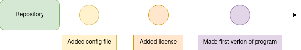
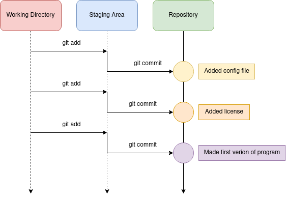
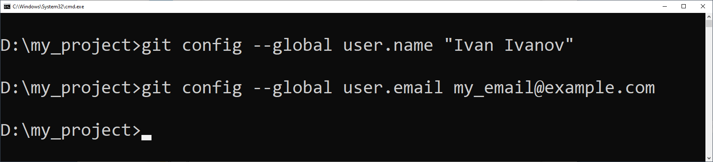

# Git

## Мотивация

Для начала дадим небольшой дислеймер: у многих Git и Github слеплены в одну сущность. Но это разные вещи - Вы можете использовать Git без Github. Обратное (использование Github без знания Git) так же возможно до определенной степени. При том что Github опирается на Git и визуализирует концепции Git, такие как коммит или ветка, этим можно пользоваться не сильно разбираясь что происходит под капотом. Мы хотим чтобы Вы задумались и могли использовать Git и Github, понимая какие действия относятся к Git, а какие к Github.

**Примечание:** существуют другие замечательные он-лайн системы, например Gitlab, которые облегачают совместной разработки на Git. Здесь мы будем говорить Github, но советуем почитать об особенностях других систем. Например Gitlab позволяет установить себя на свой собственный сервер, куда Вы можете пустить только тех кого пожелаете. Для целей open-source Github является стандартом дефакто, поэтому о нем и пойдет речь дальше.

Что же такое Git? Для ответа на этот вопрос следует обратиться к сути работы разработчика. Как правило написание приложения состоит из набора инженерных решений, появившихся в ходе решения задач - как организовать структуру данных в памяти, как перевести данные из одного формата в другой и так далее. Как правило существуют стандартные способы что-то делать, но сталкиваясь с реальностью мы должны менять их под наши задачи. Пробуя тот или иной подход мы можем сломать уже существующие функции приложения и сделать это можно даже не заметно для себя: особенно если правки проиходят в приложении, состоящего из нескольких файлов, т.е. в любом приложении. Первое что приходит на ум, это сделать копию всего проекта. В случае, если мы что-то сломаем, можно будет сравнить код до и после изменений и а крайнем случае просто вернуться к рабочей версии. Теперь представьте, что нам нужно проделывать такую опрецию каждый раз при начале работы над новой задачей. Мы можем снабжать нашу копию проекта датой и названием задачи, над которой работаем, но нам уже начинает казаться, что что-то идет не так. Мы можем окончательно убедиться в недостатках такого подхода, если нам нужно найти строчку кода, которую мы сломали несколко иттераций назад, но ошибка вылезла только сейчас. 

Похоже нам нужен инструмент, который будет автоматизировать ту часть разработки, которая отвечает за хранение копий нашего проекта после некоторых действий. **Примечание:** очень хорошо когда действия ограничены и закончены, тогда мы говорим об таком важном понятии как **атомарность** - изменения между копиями сфокусированы на одной задачке. Функциональность этого инструмента понятная из описанной выше ситуации:
    
    * хранение изменений между версиями нашего приложения, т.е. хранение истории изменений. **Примечание:** выше мы говорил о хранении копий, и это удобно для человека. Для машины без разницы, что хранить, а хранение только изменений выгодно с точки зрения занимаего места.
    * знать когда были изменены определенные строчки кода.
    * добавлять определеные файлы к истории изменений, чтобы соблюсти требование **атомарности**.

Навярняка похожие требования возникали у разных разработчиков, и в конечном итоге реализовывались в интсрументах, которые нахываются системами контроля версий, к которым относиться и Git. 


## Система контроля версий Git

Трудно определить точное количество людей, использующих Git. Тем не менее, Git широко применяется разработчиками и организациями по всему миру и считается самой популярной системой контроля версий.


**Git** – это система управления версиями (*Version Control System, VCS*) с распределенным контролем состояния репозитория. Это значит, что каждый разработчик имеет полную копию репозитория (директория, содержащая все файлы проекта и историю изменений этих файлов) на локальном компьютере. Это позволяет команде разработчиков работать с кодом проекта одновременно и без конфликтов. 

## Краткий исторический экскурс

Git - это система контроля версий, созданная Линусом Торвальдсом в 2005 году. Он был разработан как средство для обслуживания ядра Linux, но в настоящее время широко используется в различных проектах и доменах. Основная цель Git состоит в том, чтобы предоставить быстрый и надежный способ хранения и контроля версий кода, чтобы разработчики могли легко отслеживать изменения, откатывать их и работать в команде.

Согласно отчету GitHub Octoverse за 2019 год, на GitHub было более 40 миллионов пользователей, и большинство из них используют Git в качестве своей системы контроля версий. Кроме того, в отчете говорится, что на GitHub было более 100 миллионов репозиториев, и только в 2019 году в эти репозитории было внесено более 2,1 миллиарда материалов.

Помимо ***GitHub***, ***Git*** также используется на других платформах, таких как ***GitLab*** и ***Bitbucket***, а также разработчиками, которые размещают свои собственные репозитории ***Git***. Поэтому можно с уверенностью сказать, что миллионы разработчиков используют Git для контроля версий и совместной работы. В целом, использование *Git* постоянно растет, поскольку он широко применяется разработчиками,  различыми организациями и корпорациями по всему миру став негласным стандартом. 

Выполним несколько простых действий, чтоб начать работать с этим крутым инструментом. Для начала нужно определиться с целью: поскольку ***Git*** это прежде всего инструмент для удобной и эффективной работы команды разработчиков с кодом, мы сформулируем следующую задачу: 

>*Мы команда IT стартапа. У нас есть исходный код нашего продукта. Мы планируем его развивать, а также добавлять новый функционал, расширяя его возможности. Также мы планируем постепенно подключать к работе новых разработчиков. Делиться кодом в соц. сетях, как и с помощью облачных сервисов, ненадежно и опасно как для нашего проекта, так и для пользователей нашего продукта. В таком случае всегда есть риск "порчи кода", кражи интеллектуальной собственности, рост ошибок и уязвимостей в коде из-за отсутствия единой системы контроля версий. Мы будем использовать тестовый код, представленный ниже.*

## Установка Git на Windows

Скачаем приложение ***Git*** c официального сайта: https://git-scm.com и установим его на компьютер.


В случае если вы используете ОС Windows, выбирете подходящий вариант, соответствующий разрядности вашей ОС (x64, x32).  


Запустите файл установочный файл и следуйте инструкциям.


В результате у вас должно отобразиться следующее окно, сообщающее об успешной установке Git на ваш компьютер.


После завершения установки убедимся в том, что ***Git*** корректно установился на компьютер и мы можем приступать к работе. Для этого откроем командную строку в Windows и введем команду: **git**, как это показано на рисунке 2. 

Рисунок 2 – Командная строка Windows с введенной командой git

В окне консоли должна отобразиться информация о командах **Git**, как показано на риcунке 2. 

>Если у вас возникли проблемы, попробуйте удалить git из системы и повторить процесс установки, внимательно следуя инструкциям и указаниям программы установщика git.

## Простой способ использования Git

Самый простой способ использовать Git это хранить изменения своего проекта линейно, когда одно изменение идет за другим и нет одновременной работы на разными задачами. Круги показывают осмысленные набор изменений (коммиты), которые мы хотим зафиксировать, а текст в прямоугольниках соответствует описанию изменений, которые мы внесли в проект. Когда мы получили визуализацию того, что хотим получить, мы можем рассмотреть команды, которые помогут нам получить результат как на картинке.



Для начала нужно сказать, что Git уже установлен у Вас если Вы пользуетесь Linux или MacOS. Для Windows нам нужно его  как было показано выше. Мы будем пользоваться Git в режиме командной строки, так как это универсальный способ для всех операционных систем. Вы можете установить программу с графическим интерфейсом для использования Git, по сути эта программа будет выполнять те или иные Git при манипаляциях в графическом интерфейсе. Мы рекомендуем научиться пользоваться Git в командной строке, поскольку это может быть единственной опцией, как во время работы на удаленном сервере, где установлена ОС без оконного интерфейса. Мы будем так же использовать `bash`, что позволит каждому, кто это читает просто копировать команды не перепечатывая их со скришотов. **Все команды которые начинаются со слова `git` относятся к Git, остальные относятся к `bash`.**

Давайте создадим свой первый **репозиторий**.

```bash
mkdir first_git_project
cd first_git_project
git init 
```

И видим что репозиторий успешно создан.

```bash
Initialized empty Git repository in /home/user/first_git_project/.git/
```

**Репозиторий** - папка изменения в которой отслеживаются Git, а измения всех файлов с момент начала отслеживания храняться. Вся история и служебная информация храниться в папке `.git`, проверьте что она есть, выполнив в папке `first_git_project` команду:

```bash
ls -al
```

Если потребуется введите 

```
git config --global user.name "Name Surname" 
git config --global user.email email@domain.com	 
```

Команду `git init` можно выполнить в любой папке. Команды, которые мы будем обсуждать дальше относятся к репозиторию и должны выполняться внутри репозитория. Следущая команда, которую лично я на автомате использую после любой другой команды Git, это `git status`. Эта команда выводит информацию о состоянии репозитория и отслеживаемых файлах:

```bash
git status
```
И увидим:

```bash
On branch master

Initial commit

nothing to commit
```

`Initial commit` говорит о том что у нас пустой репозиторий, в котором еще ничего нет; `nothing to commit` - что у нас нет изменений которые можно зафиксировать; `On branch master` - что мы находимся на ветке master (мы честно не хотели упоминать это слово так рано, но из вывода команды слов не выкинешь). Напомним, что мы все это делаем для того, чтобы облегачить себе жизнь при отслеживании изменений в проекте, так давайте уже создадим файлы и посмотрим как это работает. В папке `first_git_project` выполним:

```bash
touch config.txt
echo "Author = Artem Vesnin" >> config.txt
echo "Description = Dummy project to illustrate git" >> config.txt
```
И проверим что изменилось для Git:

```bash
git status
```
Мы видим что часть информации не изменилось, например `On branch master` и `Initial commit`, но появилось и новая:

```bash
On branch master

Initial commit

Untracked files:
  (use "git add <file>..." to include in what will be committed)

        config.txt

nothing added to commit but untracked files present (use "git add" to track)
```

Появилась секция `Untracked files`, которая содержит файлы которые появились в **репозитории**, но еще не отслеживаются (untracked) Git. Дело в том, что Git не включает все появившиеся в репозитории в отслеживаемые файлы. Это разумно так как в проекте может быть множество файлов, которые постоянно меняются, но при этом являются первичными, а могут быть воспроизведены из исходных текстовых файлов, например `.o` или `.pyc` файлы. Еще одно изменение состоит в том что фраза `nothin to commit` поменялась на `nothing added to commit but untracked files present` - мы ничего не добавили что бы зафиксировать, т.е. ничего не войдет в следующий коммит (commit). **Коммит** - это фиксация изменнений, при этом мы выбираем что войдет в коммит, так же как выбираем какие файлы будут отслеживаться Git. У нас есть неотслеживаемы файл config.txt и мы хотим начать отслеживать его изменения, для этого выполним команду, которая содержиться в качестве подсказки `(use "git add" to track)`:

```bash
git add config.txt
``` 

Посмотрим что поменялось:

```bash
git add status
``` 

Вывод опять поменялся и содержит результат наших действий:

```
On branch master

Initial commit

Changes to be committed:
  (use "git rm --cached <file>..." to unstage)

        new file:   config.txt
```

Теперь у нас нет неотслеживаемых файлов, а `config.txt` перешел в файлы, которые будут добавлены в следующий **коммит** (`Changes to be committed`), мы помним что Git не будет делать автоматический коммит за нас, мы должны явно выполнить команду, которая это сделает. Обратим внимание на подсказку  `use "git rm --cached <file>..." to unstage`, она говорит о том что нужно сделать чтобы убрать файл из отслеживаемых, если мы добавили его случайно. Всегда читайте подсказки, скорее всего там есть ответы на часть Ваших вопросов. Теперь мы готовы сделать первый коммит:

```bash
git commit -m "Added config file"
```

При каждом коммите мы указываем сообщение, которое отражает суть внесенных изменений. 

```
[master (root-commit) 37015f6] Added config file
 1 file changed, 2 insertions(+)
 create mode 100644 config.txt
```

Вывод после команды `git commit` содержит информации о том сколько файлов и строк кода было изменено, а так же уникальный индентификатор коммита `37015f6`. И по традиции:

```bash
git add status
```

Видим что все "чисто" все изменения зафиксированы:

```
On branch master
nothing to commit, working directory clean
```

Только после этого можно считать что Git знает про наши изменения и будет их хранить. А мы готовы перейти к следующей задаче, решение которой будет уложено в один или несколько коммитов. На примере ниже показано отношение команд Git и "областей" куда эти команды перемещают изменения. Как мы видели раньше `git add` не фиксирует изменения сразу, но добавляет их в специальную область `staging area`, поле чего изменений можно будет закоммитить в репозиторий. Код этой секции создал только первый коммит из цепочки - `Added config file`. **Задача: потренируйтесь с git и сделайте два других коммита как показано на рисунке.**



Мы рассмотрели простейший способ использования git, ниже посмотрим на пример использования с кодом, который делает что-то полезное, а также изучим новые команды.
 
## Тестовый код программы 

В качестве примера будем использовать код тестовой программы, разработанной на языке Python, для наглядной работы с системой контроля версий git. Тестовая программа выполняет запрос на сервис погоды *OpenWeatherMap*, используя обращение к сервису по API, затем полученный результат записывается в базу данных SQLite.

```python
import requests
import sqlite3
# Connect to the SQLite database
conn = sqlite3.connect("example.db")
cursor = conn.cursor()
# Create a table to store the data
cursor.execute("""
CREATE TABLE IF NOT EXISTS weather (
id INTEGER PRIMARY KEY,
city TEXT,
temperature REAL
)
""")
# Make a request to the API
url = """https://api.openweathermap.org/data/2.5/weather? 
q=London&appid=your_api_key"""

response = requests.get(url)
data = response.json()
# Extract the relevant data
city = data["name"]
temperature = data["main"]["temp"]
# Insert the data into the table
cursor.execute("INSERT INTO weather (city, temperature) VALUES (?, ?)", 
               (city, temperature)
              )
# Commit the changes to the database
conn.commit()
# Close the connection to the database
conn.close()
```

## Описание тестовой программы

Эта программа сначала подключается к базе данных SQLite с именем ***example.db*** и создает таблицу с именем ***weather***, если она еще не существует. 
Затем он делает запрос к общедоступному API (в данном случае API OpenWeatherMap), используя библиотеку запросов ***requests***. Ответ от API анализируется как JSON, и из него извлекаются необходимые данные. 
Наконец, данные вставляются в таблицу ***weather*** в базе данных SQLite с помощью оператора вставки SQL, и изменения фиксируются.

Обратите внимание, что вам нужно заменить ***your_api_key*** на ваш собственный ключ API из *OpenWeatherMap* API, иначе данный код не будет работать. Кроме того, на вашем компьютере должна быть установлена библиотека *sqlite3*, она используется для работы с базой данных SQLite.

>**Важно иметь в виду, что этот код является примером, в котором отсутствуют многие важные детали, которые должны учитываться перед выпуском проекта в виде готового продукта**. 
>Например, обработка ошибок и исключительных ситуаций, такие как сбои соединения, ошибки API и возможные ошибки выполнения SQL запроса к СУБД. Также, данный код не учитывает должным образом вопросы безопасности. Используя данный код, разработчики должны понимать, какие недостатки присутствуют в предоставленном тестовом коде.

## Оформление рабочего каталога

Для удобства работы с файлами проекта создадим директорию с названием **my_project**, например, на диске **`D:\`**. Можно выбрать другое расположение папки с проектом. В качестве примера далее будем считать, что путь к файлам проекта выгляди следующим образом: "**D:\my_project**".

Перейдем в директорию с нашим проектом (**my_project**) и вызовем командную строку, как показано на рисунке 3. Для этого нужно нажать на строку, содержащую путь к текущей папке, ввести команду *cmd* и нажать на клавиатуре кнопку *Enter*.


Рисунок 3 – Вызов командной строки в текущей папке

После выполнения данной команды должно отобразиться окно консоли (рисунок 4). В этом окне мы продолжим работу с Git.   


Рисунок 4 – Командная строка в текущей папке проекта

## Настройка конфигурации git

Перед тем как приступить к работе с кодом, нужно выполнить краткую настройку Git, а именно указать имя пользователя и почтовый адрес, эта информация используется системой Git для отслеживания операций всех пользователей проекта в репозитории. Это нужно выполнить только один раз. При работе с другим проектом вам не нужно повторно указывать имя пользователя и почтовый адрес.

|Команда git |	Описание |
|:---------------------|:---------|
|git config --global user.name "Ivan Ivanov"|Изменяем имя пользователя в git|
|git config --global user.email my_email@example.com | Изменяем название почты пользователя|

Ниже представлен пример выполнения данных комманд в консоли Git:

```
 git config --global user.name "Ivan Ivanov" 
 git config --global user.email my_email@example.com	 
```

Репозиторий - это каталог, в котором располагаются все файлы одного проекта. В нашем случае у нас есть каталог "**my_project**", его мы и будет использовать. В итоге у вас должно получиться так же, как показано на рисунке 5.


Рисунок 6 – Ввод имени и почты пользователя в настройках Git

Если вы хотите проверить используемую конфигурацию, можете использовать команду: **`git config --list`**, чтобы показать все настройки Git текущего репопзитория:

```
user.name= Ivan Ivanov
user.email= my_email@example.com
color.status=auto
color.branch=auto
color.interactive=auto
color.diff=auto
```

Также вы можете проверить значение конкретного ключа, выполнив **`git config <key>`**:

```
git config user.name
Ivan Ivanov
```

Если вам нужна помощь при использовании Git, есть три способа открыть страницу руководства по любой команде Git:

```
git help <команда>
git <команда> --help
```

Например, так можно открыть руководство по команде **`git config`**:

```
git help config
```

После ввода имени пользователя и адреса электронной почты, можно закончить с настройкой Git и перейти к знакомству с основными командами Git. 

Для базового варианта использования Git достаточно знать всего несколько команд для ведения истории изменений.

- Команда **`git init`** создаёт в текущем каталоге новый подкаталог с именем **`.git`**, содержащий все необходимые файлы репозитория и структуру git репозитория. На этом этапе ваш проект ещё не находится под версионным контролем.
- Команда **`git add`** добавляет содержимое рабочего каталога в индекс (staging area) для последующего коммита: **`git add <название файла_1, название файла_2>`**. По умолчанию **`git commit`** использует лишь этот индекс, так что вы можете использовать **`git add`** для сборки слепка вашего следующего коммита. Это одна из ключевых команд Git. 
- Команда **`git status`** показывает состояния файлов в рабочем каталоге и индексе: какие файлы изменены, но не добавлены в индекс; какие ожидают коммита в индексе. Вдобавок к этому выводятся подсказки о том, как изменить состояние файлов. 
- Команда **`git commit`** берёт все данные, добавленные в индекс с помощью **`git add`**, и сохраняет их слепок во внутренней базе данных, а затем сдвигает указатель текущей ветки на этот слепок.
- Команда **`git push`** используется для установления связи с удалённым репозиторием, определения локальных изменений, отсутствующих в текущей версии кода, и собственно их передачи на удаленный репозиторий, например, *GitHub* или *Bitbucket*.
- Команда **`git pull`** работает как комбинация команд **`git fetch`** и **`git merge`**, т.е. Git вначале забирает изменения из указанного удалённого репозитория, а затем пытается объединить (выполнить слияние) их с текущим кодом (веткой).

## Первый пример работы с git

Отлично! Теперь, когда мы настроили параметры нашего git и познакомились с основными командами, выполним следующие действия: 
1. Выполним инициализацию репозитория в папке с проектом.
2. Проверим статус нашего репозитория.
3. Добавим файл с тестовым кодом test_project.py для отслеживания его изменений в git.
4. Создадим первый коммит и посмотрим, как изменится статус git.

- **Шаг 1: Инициализация нашего рабочего каталога (репозитория)**
Когда вы инициализируете репозиторий командой **`git init`**, Git создаёт ветку с именем **master** по умолчанию. В результате мы настроили рабочее окружение Git и выполнили инициализацию репозитория (рисунок 5) .

 
Рисунок 5 – Вызов команды **`git init`**

- **Шаг 2: Проверка статуса репозитория**
После того как был создан репозиторий, мы можем отслеживать все изменения (статус) в рабочей папке нашего проекта, вызвав команду **`git status`**. Что это значит? Дело в том, что после выполнения команды **`git init`** все изменения в директории ***my_project*** будут контролироваться (отслеживаться) системой управления версиями Git. В директории ***my_project*** есть файл ***test_project.py*** с тестовым кодом на языке Python. Давайте выполним команду **`git status`**, как показано на рисунке 6. 
 

Рисунок 6 – Вызов команды **`git status`**

В результате работы команды **`git status`** мы видим несколько сообщений. Давайте разберемся, что они означают. 
| Сообщение Git | Описание |
|-------------------|----------|
| On branch master | Сообщение, в котором содержится информация о том, что мы находимся в ветке master.|
| No commits yet |	В текущий момент нет коммитов, готовых для их фиксации, внесения каких-либо подготовленных изменений в проект. |
| Untracked files: use "git add <file>..." to include in what will be committed test_project.py	| Найден файл «test_project.py», который в данный момент находится в папке проекта, но его состояние пока не контролируется системой git. И дается справка о том, что для добавления этого файла нужно использовать команду git add.|
| nothing added to commit but untracked files present (use "git add" to track)|	Отсутствуют коммиты, но присутствуют неотслеживаемые файлы.|
 
С этого места давайте поподробней. Команда **`git status`** вывела нам подробную информацию о том, в каком состоянии в данный момент находится наш проект с точки зрения системы контроля версий Git. В текущей директории есть файл **test_project.py** с тестовым кодом и пока что изменения этого файла никак не отслеживаются. Поскольку мы планируем работать с этим кодом и хотим знать, какие измения были внесены нами, либо кем-то из разработчиков нашей команды, нам нужно добавить его под контроль Git. 

- **Шаг 3: Добавление файла для отслеживания изменинй git**
Чтоб добавить файл для отслеживания его изменений, выполним команду: **`git add test_project.py`**, как показано на рисунке 7.


Рисунок 7 – Вызов команды `git add`

Выполним повторно вызов команды "**`git status`**" и посмотрим, что изменилось (рисунок 8). 

Рисунок 8 – Вызов `git status` после выполнения команды `git add`

Видим, что теперь текст сообщения несколько изменился. Строка с названием нашего тестового файла изменилась. Ранее она была выделена красным цветом (рисунок 6). Сейчас же эта строка выделена зеленым цветом и добавилась приставка "**`new file: test_project.py`**". Это означает, что теперь Git видит начал следить за изменениями этого файла, но пока мы их не зафиксировали. Другими словами, Git увидел файл и готов зафиксировать это изменние. Для этого нам надо выполнить коммит (commit).

- **Шаг 4: Создаем коммит** 
Чтобы выполнить коммит (сохранить измненения и зафиксировать текущую версию), выполним следующую команду: **`git commit –m "текст сообщения – начинаем использовать git!"`**. 
На рисунке 9 видим, что Git обработал нашу команду и вернул результат, в котором сказано, что в ветке ***master*** изменен 1 файл, в который добавлено 26 строк. 


Рисунок 9 – Создание первого коммита

Другими словами, до того, как мы добавили файл (**`git add`**) и создали коммит (**`git commit`**), нашей системе Git нечего было отслеживать, поскольку в нем не было ни одного коммита. Теперь немного остановимся на самой команде "**`git commit`**".  
После команды **`git commit`** мы использовали параметр **`–m`** и в кавычках **`" "`** написали сообщение для коммита. Это очень полезная фишка для комментирования изменений кода. Например, мы добавили в код новую функцию или исправили ошибку в работе программы и хотим зафиксировать это улучшение, кратко сформулировав смысл вносимых изменений в код. 

Сейчас в нашем проекте "**test_project.py**" нет проверок корректности данных, как и проверки наличия связи с удаленным сервером погоды (*OpenWeatherMap*). Когда мы дабавим проверку корректности данных, нужно будет создать коммит и в качестве комментария указать: 
"*Добавлена проверка кода ответа от сервера OpenWeatherMap. Если код ответа: 200, данные корректны, в другом случае возникает обарботки исключительной ситуации*". 

Конечно, помимо сообщения при создании коммита рекомендуется использовать комментарии в коде программы и вести документацию. 

Для отслеживания всех изменений Git удобно использовать утилиту **`git-show`** - это утилита командной строки, которая используется для просмотра подробных данных об объектах Git (рисунок 10). 
 

Рисунок 10 – Отображение подробной информации вызовом команды `git show --pretty`

**Что делать, если ошибочно внесли неполное или некорректное описание коммита?** 
На этот случай не стоит паниковать. Всегда можно изменить содержание коммита. Чтобы изменить последний коммит, используйте комманду: **`git commit –amend`**. После вызова команды откроется текстовый редактор, в котором можно изменить текст сообщения (рисунок 11).
 

Рисунок 11 – Окно редактора текста, в котором можно изменить последний коммит

После того, как вы внесете изменения в текст коммита, нужно сохранить изменения в этом файле. После этого в консоли отобразится «новое сообщение» измененного коммита (рисунок 12).


Рисунок 12 – Отображение изменений коммита

Попробуйте внести изменения в файл "**test_project.py**". Например, изменив его следующим образом:

``` python
import requests
import sqlite3

# Connect to the SQLite database
conn = sqlite3.connect("example.db")
cursor = conn.cursor()
# Create a table to store the data
cursor.execute("""
CREATE TABLE IF NOT EXISTS weather (
    id INTEGER PRIMARY KEY,
    city TEXT,
    temperature REAL
)
""")
# Make a request to the API
try:
    url = """https://api.openweathermap.org/data/2.5/weather?""" \                      """q=London&appid=your_api_key"""
	Response = requests.get()
	Response.raise_for_status()
	
	data = response.json()
	# Extract the relevant data
	city = data["name"]
	temperature = data["main"]["temp"]
	# Insert the data into the table
	cursor.execute("INSERT INTO weather (city, temperature) VALUES (?, ?)", 
                   (city, temperature))
	# Commit the changes to the database
	conn.commit()
	# Close the connection to the database
	conn.close()
except requests.exceptions.HTTPError as err:
    print(err):
```

Мы добавили в код проверку возникновения исключительных событий. Исключения необходимы для того, чтобы сообщать программисту об ошибках, а также корректно их обрабатывать, чтобы избавиться от экстренного завершения работы программы. Сохраните изменения в файле с кодом и вызовите комманду **`git status`**. Посмотрите, какой будет результат? 

## Вот несколько шагов, которые помогут начать работу с Git:

Изучите основы: начните с изучения основных команд Git, таких как `git init`, `git add`, `git commit`, `git branch`, `git checkout`, `git merge` и `git push`. В Интернете есть множество ресурсов, таких как учебные пособия, видеоролики и документация, которые могут помочь понять основные концепции и команды.
Лучший способ изучить Git – это использовать его. Создайте новый проект, возьмите наш тестовый проект или найдите проект с открытым исходным кодом и начните экспериментировать с командами Git. Совершайте коммиты, создавайте ветки и пробуйте разные сценарии рабочего процесса Git.

## Что такое публичный и приватный репозиторий?

В Git репозиторий (или сокращенно «репо») — это набор файлов и каталогов, которые отслеживаются системой контроля версий. Репозиторий может быть как общедоступным, так и частным.
1. Общедоступный репозиторий. Общедоступный репозиторий — это репозиторий, доступный для всех, у кого есть URL-адрес репозитория. Любой может просмотреть файлы, загрузить их и сделать копию репозитория. Публичные репозитории часто используются для проектов с открытым исходным кодом, где каждый может внести свой вклад в код. Публичные репозитории также используются для обмена кодом с другими или для того, чтобы сделать код доступным для использования другими.
2. Частный репозиторий. Частный репозиторий – это тот, который недоступен никому, кроме людей, которым был предоставлен доступ. Эти репозитории часто используются для проектов с закрытым исходным кодом, где код не предназначен для общего доступа. Частные репозитории также используются для хранения кода, который не готов к публичному выпуску, или для конфиденциальной информации, которой не следует делиться с общественностью.
Основное различие между двумя типами репозиториев заключается в том, что общедоступные репозитории видны и доступны всем, а частные репозитории видны и доступны только избранной группе людей.
Стоит отметить, что большинство служб хостинга Git, таких как GitHub, GitLab, Bitbucket, предлагают как общедоступные, так и частные репозитории с разными ценами и ограничениями, некоторые из них предлагают бесплатные планы для общедоступных репозиториев и взимают плату за частные.

GitHub, GitLab и Bitbucket — популярные платформы хостинга Git, которые предоставляют как общедоступные, так и частные репозитории. На этих платформах вы можете сделать свой репозиторий общедоступным или частным при его создании. Вы также можете изменить видимость репозитория позже, но изменить его обратно может быть немного сложнее, если он общедоступный.
Важно помнить, что термины «общедоступные» и «частные» репозитории относятся к хостинговой платформе и пользователям, имеющим доступ к репозиторию, а не к Интернету в целом.
 
## Зафиксируйте изменения git

Коммит — это моментальный снимок изменений, внесенных в файлы в репозитории Git. Он используется для сохранения и отслеживания хода проекта с течением времени. Вот шаги для фиксации изменений в Git:
1. Добавьте файлы в промежуточную область. Прежде чем делать фиксацию, вам необходимо добавить файлы, которые вы хотите включить в фиксацию, в промежуточную область. Вы можете сделать это, выполнив команду `git add file-name` или `git add`, чтобы добавить все измененные файлы.
2. Создайте фиксацию: после добавления файлов в область подготовки вы можете создать фиксацию. Используйте команду `git commit` для создания коммита. Это откроет текстовый редактор по умолчанию, в котором вы можете написать сообщение фиксации.
3. Фиксация с сообщением: вместо того, чтобы открывать текстовый редактор по умолчанию, вы можете использовать флаг `-m` для фиксации с сообщением, выполнив команду `git commit -m "Ваше сообщение фиксации"`.
4. Зафиксировать с определенным файлом. Вы также можете зафиксировать определенный файл, выполнив команду `git commit имя-файла -m «Ваше сообщение о фиксации»`.
Важно использовать четкие и описательные сообщения фиксации, которые объясняют сделанные изменения и причину, по которой они были сделаны. Это упрощает понимание истории проекта и помогает другим членам команды понять изменения.
Кроме того, вы также можете использовать команду `git commit --amend`, чтобы изменить последнюю фиксацию, или `git commit --amend -c original-commit`, чтобы изменить предыдущую фиксацию.

## Немного статистики о системе git 

Git –  одна из наиболее широко используемых систем контроля версий в мире, и статистика её использования отражает это. Вот некоторая статистика использования Git:
1. Популярность. Согласно опросу разработчиков Stack Overflow 2020, Git – самая популярная система контроля версий, которую используют более 88% разработчиков.
2. Проекты с открытым исходным кодом. По данным GitHub, на их платформе размещено более 100 миллионов репозиториев, и большинство из них представляют собой проекты с открытым исходным кодом, использующие Git в качестве системы контроля версий.
3. Использование в отрасли: Git используется в самых разных отраслях, включая разработку программного обеспечения, финансы, здравоохранение и правительство.
4. Кроссплатформенность: Git можно использовать в операционных системах Windows, Mac и Linux, что делает его кроссплатформенным инструментом.
5. Интеграция: Git можно интегрировать с широким спектром инструментов и сервисов, таких как GitHub, GitLab, Bitbucket, Jenkins и другими.
6. Совместная работа: Git позволяет нескольким людям одновременно работать над одной кодовой базой и имеет встроенные инструменты для совместной работы, такие как запросы на вытягивание и проверки кода.
7. Принятие: согласно официальному веб-сайту Git, более 100 000 организаций по всему миру используют Git для контроля версий.

Эти статистические данные показывают, что Git является широко распространенным и универсальным инструментом, который используется большим количеством разработчиков и организаций по всему миру.

