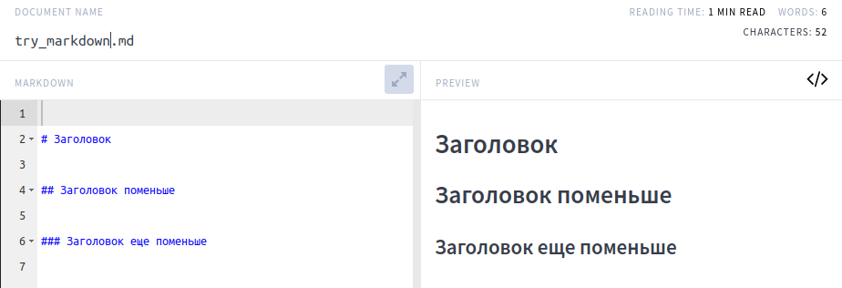
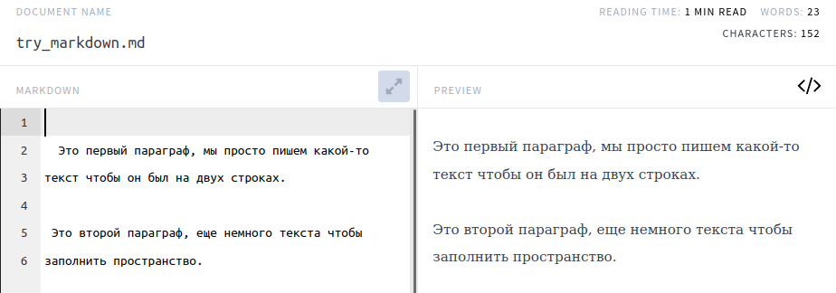
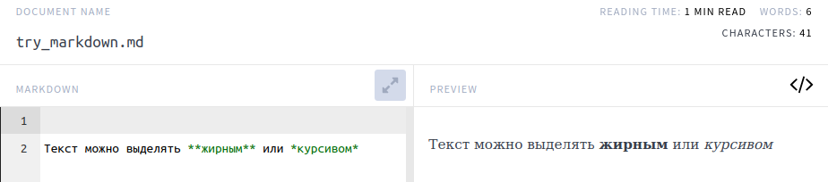
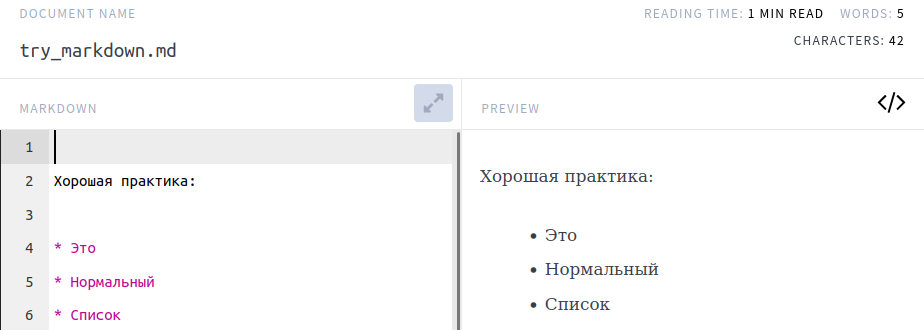
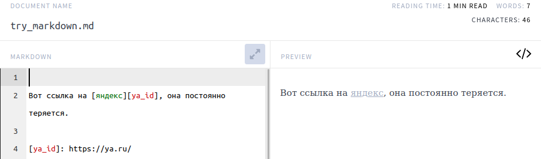
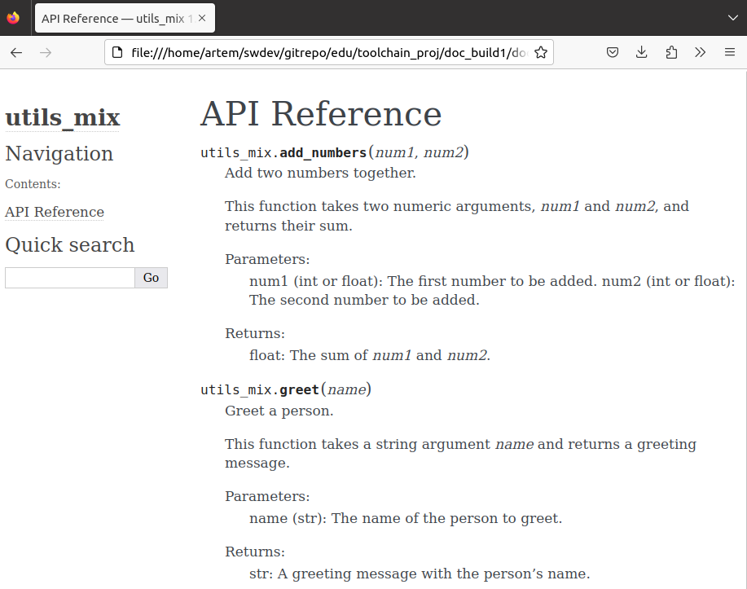
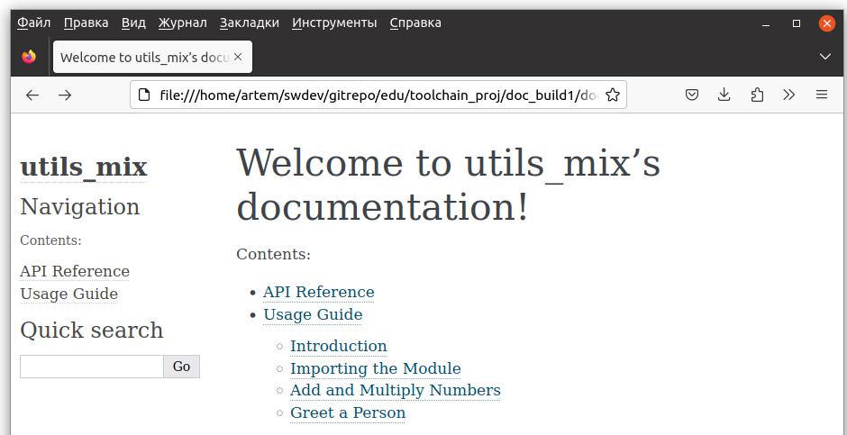

# Документирование

## Мотивация

Наверное многие из вам слышали про TDD, когда тесты пишутся не до кода, и затем только пишется сам код для того, который пройдет все тесты. Такой подход позволяет взглянуть на код с другой стороны и, при правильном отношении, лучше структурировать его. Другой способ лучше писать код это так называемая "Readme-driven-development" т.е. такой способ разработки при котором мы пишем сначала документацию к коду включая readme так и документацию функций (docstring в python). Простой пример: **если у вас есть трудности с тем чтобы описать работу функции, скорее всего ее нужно разбить на несколько функция и задокументировать каждую по отдельности**. Наличие документации, особенно если она хорошо составлена поможет не только другим разработчикам, но и вам самим, чтобы восстановить контекст и понять что же вы имели ввиду кода писали этот код год назад. 

## Markdown

Когда мы писали свою простую библиотеку, мы делали файл README.md, содержимое которого собиралось в красивый [документ](https://github.com/standlab/mtracker/blob/main/README.md) самим GitHub. В этом случае мы использовали язык разметки `markdown`, который является одним из общепринятых способов оформления документации. Рассмотрим элементы разметки, в данном документе мы использовали [онлайн-редактор](https://dillinger.io/), но подойдет и любой другой. 

### Заголовки

Чтобы сделать текст заголовком, используйте один или несколько знаков решетки, чем их больше, тем меньше заголовок:



[Можно](https://www.markdownguide.org/basic-syntax/#alternate-syntax) обозначать заголовки через подчеркивания. **Хорошим тоном** считается отделение заголовка от текста выше и ниже, а также отделение знака решетки от текста заголовка: 

```
...какой-то текст до.

# Заголовок

Начало раздела...

```

### Абзацы

Чтобы в тексте начать новый абзац, разделите текст пустой строкой:


**Хорошим тоном** считается, когда мы пишем текст без отступов.

Так делаем:


А так нет:



Хотя результат будет один и тот же, мы всегда думаем не только о тех, кто читает собранный документ, но и о тех кто читает исходник. Различные отступы сильно затрудняют чтение.

### Форматирование текста

Текст можно делать жирным или курсивом:



Вместо звездочек можно использовать подчеркивания, но звездочки являются более универсальным способом выделения текста.

***Задание: как сделать шрифт жирным курсивом.***

### Cписки

В `markdown` можно делать нумерованный список или просто перечисление пунктов.


Мы можем использовать разные символы для ненумерованных списков (`-`, `*`, `+`), **хорошей практикой** является использование одного из них:



Не смешивайте несколько:


### Ссылки

Для того, чтобы вставить ссылку, пишем ее название в `[]` и после саму ссылку в `()`, название будет отображено в собранном документе:


Можно не вставлять ссылки в самом тексте, а вести их список отдельно и использовать id ссылки, там где нужно.



### Вставка изображений

Вставка изображений напоминает использование ссылок. Мы пишем текст, который будет показан вместо изображения, если оно не будет подгружено в `[]`, и указываем путь или ссылку на изображение. Вначале мы ставим восклицательный знак, а в круглых скобках можем указать всплывающую подсказку:

```

```


Если ошибиться в пути, будет показан текст из `[]`:

```

```


**Задание: проверьте, можно ли вести список картинок отдельными и вставлять их, используя id**

### Код

В случае необходимости процитировать в документации исходный код программы или его части используются специализированные форматированные блоки в которые помещаются фрагменты исходного кода программы. Это похоже на HTML-теги. Для создания блока кода в языке Markdown необходимо обрамить его символами \`\`\` код программы \`\`\`. Многие программмы поддерживают форматирование текста Markdown в соответствии стилю содержимого. Если мы оформим код программы, то в режиме просмотра его синтаксис будет подсвечиваться (как в среде разработке). Для лучшего распознавания стиля языка программирования следует указывать название языка или скрипта для применения подсветки его синтаксиса. Например, для представления фрагмента программы на языке Python лучше оформить его следующим образом: 

 \```python  
import os  
  
def foo():  
&nbsp;&nbsp;&nbsp;&nbsp;path = os.getcwd()  
&nbsp;&nbsp;&nbsp;&nbsp;print(f" Путь к текущей директории = {}\n\nСписок файлов:\n")  
&nbsp;&nbsp;&nbsp;&nbsp;rez = sorted(os.listdir(path)    
&nbsp;&nbsp;&nbsp;&nbsp;for n, item in enumerate(rez):  
&nbsp;&nbsp;&nbsp;&nbsp;&nbsp;&nbsp;&nbsp;&nbsp;print(n+1, item)  
\```

После того как вы откроете этот документ например в браузере, Вы увидите что код преобразился, его стиль изменился и стал больше похож на програмный код.  


``` python  
import os  

def foo():  
    path = os.getcwd()  
    print(f" Путь к текущей директории = {}\n\nСписок файлов:\n")  
    rez = sorted(os.listdir(path)    
    for n, item in enumerate(rez):  
        print(n+1, item)  
```


### Цитирование

В текст можно выставлять цитаты:


## reStructuredText

Сейчас будет неожиданно. Но дальше нам будет нужен другой язык разметки `reStructedText`. Для тех, кто потратил время на материал выше, будет [несложно](https://docs.open-mpi.org/en/v5.0.x/developers/rst-for-markdown-expats.html) освоить и `reStructedText`. Причины, по которым мы описали `Markdown` и затем предложили переключиться на `reStructedText`, две:

1. Курс написан с использованием `markdown`
2. Инструмент (sphinx), который соберет документацию для нашего пакета и сделает из нее красивые `html`-страницы или `pdf`, работает нативно с файлами `reStructuredText`. Для работы с `markdown` требуется подключать дополнительный плагин.

Вы можете изучить отличия чуть позже, сейчас мы возьмем open source [конвертер](https://github.com/miyakogi/m2r#sphinx-integration) `md` в `rst` и используем его. Для README это вполне рабочий вариант. Серьезную документацию лучше сразу писать в формате `rst`.

## sphinx

`sphinx` это достаточно мощный инструмент, который может собрать не только документацию к проекту и сделать из нее веб-страницы, которые мы можем потом разместить на [readthedocs](https://readthedocs.org/), но и текст для мануалов `man`, которые являются стандартным для `bash`.

**Обращайте внимание на то, в каких каталогах мы выполняем те или иные операции в `bash` во вставках кода ниже**

Создадим пустой каталог и перейдем в него, создадим каталог для документации в этой папке и заберем себе `README.md`:

```bash
(mtracker) artem@pc:~/tmp$ mkdir test_the_docs
(mtracker) artem@pc:~/tmp/test_the_docs$ cd test_the_docs
(mtracker) artem@pc:~/tmp/test_the_docs$ mkdir docs
(mtracker) artem@pc:~/tmp/test_the_docs$ wget https://raw.githubusercontent.com/standlab/mtracker/main/README.md
(mtracker) artem@pc:~/tmp/test_the_docs$ ls
docs  README.md 
```

Теперь установим `sphinx` и конвертер `rst -> md`, конвертируем README.md:

```bash
(mtracker) artem@pc:~/tmp/test_the_docs$ pip install sphinx
(mtracker) artem@pc:~/tmp/test_the_docs$ pip install m2r
(mtracker) artem@pc:~/tmp/test_the_docs$ m2r README.md
(mtracker) artem@pc:~/tmp/test_the_docs$ ls 
docs  README.md  README.rst
```

*Примечание: если бы у нас сразу был файл в формате, команды с `m2r` можно пропустить.*

Теперь мы готовы инициализировать каталог с документацией. 

```bash
(mtracker) artem@pc:~/tmp/test_the_docs$ cd docs
(mtracker) artem@pc:~/tmp/test_the_docs/docs$ sphinx-quickstart
(mtracker) artem@pc:~/tmp/test_the_docs/docs$ ls
build  make.bat  Makefile  source
```

На этом этапе вам будут заданы вопросы про название проекта, автора, версию и язык документации. На вопрос, разделять ли исходники и собранную документацию, отвечаем да:

```sh
> Separate source and build directories (y/n) [n]: y
```

Теперь зайдем в файл `nano ./source/index.rst` и добавим в конец строки:

``` sh
Readme File
===========

.. include:: ../../README.rst
```
Это нужно для того, чтобы содержимое README было доступно в документации. *Мы пишем `../../` так как `README.rst` находится на два уровня выше, чем содержимое каталога `source`*. Теперь мы готовы собрать документацию:

```bash
(mtracker) artem@pc:~/tmp/test_the_docs/docs$ sphinx-build -b html source build
Running Sphinx v5.3.0
loading translations [ru]... готово
loading pickled environment... готово
building [mo]: targets for 0 po files that are out of date
building [html]: targets for 1 source files that are out of date
updating environment: 0 added, 1 changed, 0 removed
reading sources... [100%] index                                                  
looking for now-outdated files... none found
pickling environment... готово
checking consistency... готово
preparing documents... готово
writing output... [100%] index                                                   
generating indices... genindex готово
writing additional pages... search готово
copying static files... готово
copying extra files... готово
dumping search index in Russian (code: ru)... готово
dumping object inventory... готово
сборка завершена успешно.


(mtracker) artem@pc:~/tmp/test_the_docs/docs$ browse ./build/index.html
```

После этого должна открыться страница, на которой, кроме всего прочего, мы можем увидеть README.

## Markdown и sphinx

Ниже приведены шаги (в ОС Linux) чтобы настроить окружение для сборки документации markdown с помощью sphinx. Мы использовали этот подход при сборке данного документа. Создайте виртуальное окружение (опционально):

```bash
conda create -n sphinx_md python=3.10
conda activate sphinx_md
```

Установите sphinx и поддержку markdown:

```bash 
pip install sphinx
pip install --upgrade myst-parser

```

Укажите какие файлы должны войти в документацию:

```bash
.. toolchain documentation master file, created by
   sphinx-quickstart on Wed Mar  1 10:24:16 2023.
   You can adapt this file completely to your liking, but it should at least
   contain the root `toctree` directive.

Welcome to toolchain's documentation!
=====================================

.. toctree::
  :maxdepth: 2
  :caption: Contents:

  00_terms/main.md
  01_open_source/main.md
  
Indices and tables
==================

* :ref:`genindex`
* :ref:`modindex`
* :ref:`search`
```

Соберите html (находясь в корневой директории проекта):

```bash
make html
```

В корневой директории появится папка build, где будет находиться собранная документация.

Для сборки pdf установите latexmk и поддержку кириллицы:

```bash
sudo apt install latexmk
sudo apt install texlive-lang-cyrillic
make latexpdf
```

## Документация из кода

Здесь речь пойдет о том как писать комментарии к коду так, чтобы из них можно будет собрать документацию. В python мы можем снабдить функции и классы многострочным комментарием, который будет распознаваться системами сборки документации как docstring и на основе них будет формироваться документация к вашему проекту. В документацию попадут не все комментарии их кода, а только тe, которые оформлены как docstring. Правильно оформленный docstring может помочь другим разработчикам, и даже вам спустя время, разобраться в работе функции. 

Для того, чтобы создать нужно заключить текст в тройные кавычки. Существует несколько форматов оформления docstring ниже приведен форматирование в **стиле Google**.


```python
def my_function(arg1, arg2):
    """
    Brief description of the function.

    More detailed explanation of the function's purpose,
    arguments, and expected behavior.

    Parameters:
        arg1 (type): Description of the first parameter.
        arg2 (type): Description of the second parameter.

    Returns:
        return_type: Description of the value returned by the function.

    Raises:
        ExceptionType: Description of the exception raised, if any.
    """
    # Function implementation here
    return result
```

Мы видим, что есть несколько разделов внутри docstring. 

    * Краткое описание (в одну строку).
    * Более подробное описание
    * Входные аргументы с указанием типов
    * Тип и описание выходного значения
    * Какие ошибки могут быть выброшены из функции

Так же можно оформить docstring в других форматах, например **стиле Sphinx**.

```python 
def my_function(arg1, arg2):
    """
    Brief description of the function.

    :param arg1: Description of the first argument.
    :type arg1: type
    :param arg2: Description of the second argument.
    :type arg2: type
    :return: Description of the value returned by the function.
    :rtype: return_type
    :raises ExceptionType: Description of the exception raised, if any.
    """
    # Function implementation here
    return result
```

Или в **стиле NumpyDoc**, который был вдохновлен документацией к библиотеке `numpy`:

```python
def my_function(arg1, arg2):
    """
    Brief description of the function.

    Parameters
    ----------
    arg1 : type
        Description of the first argument.
    arg2 : type
        Description of the second argument.

    Returns
    -------
    return_type
        Description of the value returned by the function.

    Raises
    ------
    ExceptionType
        Description of the exception raised, if any.
    """
    # Function implementation here
    return result
```

## Оформление документации 

Теперь попробуем попрактиковаться с документацией. Мы хотим создать следующую структуру проекта, назначение файлов станет понятно ниже. Часть файлов будет сгенеррирована автоматически, другие мы будем править, оставшиеся нам нужно будет создать самим.

```
project/
├── docs/
│   ├── Makefile
│   ├── conf.py
│   ├── index.rst
│   ├── usage.rst
│   └── api.rst
└── src/
    └── utils_mix.py

```

Создадим новый проект, который назовем `utils_mix`. Создадим в нем две папки `src` для кода и `docs` для документации.

```bash 
mkdir src
mkdir docs
```

Перейдем в папку `docs` и выполним там инициализацию с помощью `sphinx`, который мы ранее  установили с помощью `pip install sphinx`.

```bash 
cd docs
sphinx-quickstart
```

После этого утилита спросить нужную информацию

```bash
    Please enter values for the following settings (just press Enter to
    accept a default value, if one is given in brackets).
    
    Selected root path: .
    
    You have two options for placing the build directory for Sphinx output.
    Either, you use a directory "_build" within the root path, or you separate
    "source" and "build" directories within the root path.
    > Separate source and build directories (y/n) [n]: n
    
    The project name will occur in several places in the built documentation.
    > Project name: utils_mix
    > Author name(s): ArtemVesnin
    > Релиз проекта []: 1.0.
    > Язык проекта [en]: en
```

И создаст несколько файлов включая `Makefile` для автоматический сборки.

```bash
ls
    _build  conf.py  index.rst  make.bat  Makefile  _static  _templates

```

В текущем состоянии документация будет собираться и доступна если открыть в браузере `_build/html/index.html`, но мы пока мы не увидим документации по коду.

```bash
make html

    Running Sphinx v7.0.1
    making output directory... готово
    ....
    ....
    dumping object inventory... готово
    сборка завершена успешно.
```

Теперь перейдем в папку `src` и создадим там модуль `utils_mix.py`:

```bash
cd ../src
touch utils_mix.py
```

И добавим в этот модуль код с написанными docstring.

```python
def add_numbers(num1, num2):
    """
    Add two numbers together.

    This function takes two numeric arguments, `num1` and `num2`,
    and returns their sum.

    Parameters:
        num1 (int or float): The first number to be added.
        num2 (int or float): The second number to be added.

    Returns:
        float: The sum of `num1` and `num2`.
    """
    return num1 + num2

def multiply_numbers(num1, num2):
    """
    Multiply two numbers.

    This function takes two numeric arguments, `num1` and `num2`,
    and returns their product.

    Parameters:
        num1 (int or float): The first number to be multiplied.
        num2 (int or float): The second number to be multiplied.

    Returns:
        float: The product of `num1` and `num2`.
    """
    return num1 * num2

def greet(name):
    """
    Greet a person.

    This function takes a string argument `name` and returns a greeting message.

    Parameters:
        name (str): The name of the person to greet.

    Returns:
        str: A greeting message with the person's name.
    """
    return f"Hello, {name}! How are you today?"

```

Мы можем структурировать нашу документацию, в нашем случае мы хотим чтобы docstring попали в раздел API. Создадим файл api.rst и добавим в него следующее содержание.

```rst
API Reference
=============

.. automodule:: utils_mix
   :members:
   :undoc-members:
   :show-inheritance:
```

Таким образом мы говорим что нужно сгенерировать документацию из модуля `utils_mix` (файл `utils_mix.py`).

    * `:members:` чтобы включить функции и классы из модуля
    * `:undoc-members:` для того чтобы включить даже то у чего нет docstring (опционально)
    * `:show-inheritance:` для того чтобы показывать информацию о наследовании классов друг другом.

И изменим `index.rst` чтобы `api.rst` стал включен в общую структуру. Добавим строку api в раздел `.. toctree::`

```rst
.. toctree::
   :maxdepth: 2
   :caption: Contents:

   api
```

Последнее изменение, которое нам нужно сделать это добавить в `conf.py` несколько строчек кода так, чтобы система сборки находила модули автоматически:

```python
import os
import sys

sys.path.insert(0, os.path.abspath('../src'))
```

и включить поддержку сборки документации из docstring:

```python
extensions = ['sphinx.ext.autodoc']
```

Запускаем сборку еще раз и получаем 



Мы также можем включать документы, которые написаны нами (а не сгенерированы автоматически) например примеры по использованию кода. Создадим файл `usage.rst` и добавим в него следующее содержимое.


```rst
Usage Guide
===========

Introduction
------------

Welcome to the usage guide for `utils_mix`. This guide provides examples and explanations on how to use the functions defined in the `utils_mix` Python module.

Importing the Module
--------------------

To start using `utils_mix`, you need to import it into your Python script or interactive session:

.. code-block:: python

   import utils_mix

Add and Multiply Numbers
------------------------

The `utils_mix` provides two simple functions for basic arithmetic operations:

- :func:`utils_mix.add_numbers`: Add two numbers together.
- :func:`utils.multiply_numbers`: Multiply two numbers.

Example usages:

.. code-block:: python

   # Import the module
   from utils_mix import add_numbers, multiply_numbers

   # Add two numbers
   result1 = add_numbers(1, 2)
   print("Result of addition:", result1)  # Output: 3

   # Multiply two numbers
   result2 = multiply_numbers(5, 6)
   print("Result of multiplication:", result2)  # Output: 30

Greet a Person
--------------

The `utils_mix` also provides a simple function to greet a person:

- :func:`utils_mix.greet`: Greet a person with a custom message.

Example usage:

.. code-block:: python

   # Import the module
   from utils_mix import greet

   # Greet a person
   greeting = greet("Alice")
   print(greeting)  # Output: Hello, Alice! How are you today?

```

Включим его в документацию так же как мы делали с `api.rst`, сделаем сборку `make html` и увидим обновленную документацию





## Задачи 

### Задача 1

Есть два модуля. Функции одного рассчитываю хэши и делают поиск дубликатов по ним. Фукнции второй заключаются в поиске дубликатов в файлов. Напишите документацию к ним и сделайте автоматическую сборку при помощи sphinx.

```python
#content of duplicate_finder.py
import hashlib

def calculate_hash(text):
    return hashlib.sha256(text.encode()).hexdigest()

def find_duplicates(lines):
    duplicates = {}
    for idx, line in enumerate(lines):
        line_hash = calculate_hash(line)
        if line_hash in duplicates:
            duplicates[line_hash].append(idx)
        else:
            duplicates[line_hash] = [idx]
    return duplicates


#content of file_processor.py

import os
from duplicate_hash import find_duplicates

def process_files(directory):
    duplicates_found = {}
    for filename in os.listdir(directory):
        file_path = os.path.join(directory, filename)
        if os.path.isfile(file_path):
            with open(file_path, 'r') as file:
                lines = file.readlines()
                file_duplicates = find_duplicates(lines)
                for line_hash, line_numbers in file_duplicates.items():
                    if line_hash in duplicates_found:
                        duplicates_found[line_hash].append((filename, line_numbers))
                    else:
                        duplicates_found[line_hash] = [(filename, line_numbers)]
    return duplicates_found

if __name__ == "__main__":
    # Example usage
    directory_path = "example_files"  # Replace with your target directory path
    duplicates = process_files(directory_path)
    for line_hash, occurrences in duplicates.items():
        print(f"Hash: {line_hash}")
        for filename, line_numbers in occurrences:
            print(f" - File: {filename}, Line Numbers: {line_numbers}")
        print()
```

**Ответ**

Так как написание документации творческий процесс и в отличие от кода нельзя сказать что документация работает правильно. В качестве критериев для оценивания этого задания можно взять два:

    * после прочтения документации становиться понятно как использовать функцию
    * после прочтения документации складывает представление о внутренней реализации функции

### Задача 2

Напишите генератор для тестовых данных для функция поиска дубликатов использую документацию к функциями, предположим что ее написали заранее. 


```python 
def generate_unique_words(num_words, max_len):
    """
    Generate a list of unique words.

    This function generates a list of unique words with the specified 
    number of words (num_words) and maximum word length (max_len). 
    It uses a set to ensure uniqueness.

    Parameters:
        num_words (int): The number of unique words to generate.
        max_len (int): The maximum length of each word.

    Returns:
        list: A list of unique words.

    Example:
        >>> unique_words = generate_unique_words(num_words=20, max_len=8)
        >>> print(unique_words)
        ['ghijklmn', 'opqrst', 'abcd', 'uvwx', 'ef', 'yz', 'ij', 'klm', 'gh', 
         'nopq', 'rs', 'tuvw','jkl', 'defg', 'cde', 'ijk', 'lmn', 'mn', 'hi', 
         'pqrs']
    """
    pass

def generate_unique_lines(words, num_lines, max_words):
    """
    Generate a list of unique lines.

    Parameters:
        words (list): A list of unique words.
        num_lines (int): The number of unique lines to generate.
        max_words (int): The maximum number of words in each line.

    Returns:
        list: A list of unique lines.

    Example:
        >>> unique_words = ['ghijklmn', 'opqrst', 'abcd', 'uvwx', 'ef', 'yz', 
                            'ij', 'klm', 'gh', 'nopq', 'rs', 'tuvw', 'jkl', 
                            'defg', 'cde', 'ijk', 'lmn', 'mn', 'hi', 'pqrs']
        >>> unique_lines = generate_unique_lines(words=unique_words, num_lines=10, max_words=6)
        >>> print(unique_lines)
        ['pqrs ij ghi pqrs pqrs klm nopq', 'opqrst pqrs pqrs ij pqrs', 
         'klmnopqrs pqrs jkl ij ghi rs pqrs', 'jkl ij jkl defg pqrs ijk lmn', 
         'defg cde ghi opqrst pqrs klm pqrs', 'cde ghi klm ij', 'jkl jkl ijk klm', 
         'lmn pqrs opqrst', 'ijklmn ghi', 'rs']
    """
    pass

def generate_duplicates(lines, num_dup):
   """
    Generate duplicates and their positions. 

    Duplicates are placed in the end of input list. Duplicate positions
    should include atleast 2 values for every duplicate: original line 
    position and position of duplicates originated from this line).

    Parameters:
        lines (list): A list of unique lines.
        num_dup (int): The number of duplicates to generate.

    Returns:
        list: A list of unique lines extended with duplicates.
        dict: A dictionary containing positions of duplicates in the extended list.

    Example:
        >>> unique_lines = ['pqrs ij ghi pqrs pqrs klm nopq', 
                            'opqrst pqrs pqrs ij pqrs', 
                            'klmnopqrs pqrs jkl ij ghi rs pqrs', 
                            'jkl ij jkl defg pqrs ijk lmn', 
                            'defg cde ghi opqrst pqrs klm pqrs', 
                            'cde ghi klm ij', 'jkl jkl ijk klm', 
                            'lmn pqrs opqrst', 'ijklmn ghi', 'rs']
        >>> num_duplicates = 3
        >>> extended_lines, duplicates_positions = \
                generate_duplicates(lines=unique_lines, num_dup=num_duplicates)
        >>> print("Extended Lines:")
        >>> print(extended_lines)
        ['pqrs ij ghi pqrs pqrs klm nopq', 'opqrst pqrs pqrs ij pqrs', 
         'klmnopqrs pqrs jkl ij ghi rs pqrs', 'jkl ij jkl defg pqrs ijk lmn', 
         'defg cde ghi opqrst pqrs klm pqrs', 'cde ghi klm ij', 'jkl jkl ijk klm', 
         'lmn pqrs opqrst', 'ijklmn ghi', 'rs', 'klmnopqrs pqrs jkl ij ghi rs pqrs', 
         'cde ghi klm ij', 'ijklmn ghi']
        >>> print("\nPositions of Duplicates:")
        >>> print(duplicates_positions)
        {'klmnopqrs pqrs jkl ij ghi rs pqrs': [2, 10], 
         'cde ghi klm ij': [5, 11], 
         'ijklmn ghi': [9, 12]}
    """
    pass
```

**Ответ**


```python
import random

def generate_unique_words(num_words, max_len):

    words = set()
    while len(words) < num_words:
        word_len = random.randint(1, max_len)
        word = ''.join(random.choice('abcdefghijklmnopqrstuvwxyz') for _ in range(word_len))
        words.add(word)
    return list(words)

def generate_unique_lines(words, num_lines, max_words):
    lines = []
    while len(lines) < num_lines:
        line_words_count = random.randint(1, max_words)
        line_words = random.sample(words, line_words_count)
        line = ' '.join(line_words)
        if line not in lines:
            lines.append(line)
    return lines

def generate_duplicates(lines, num_dup):
    duplicates = random.sample(lines, num_dup)
    duplicates_positions = {}
    for idx, line in enumerate(lines):
        if line in duplicates:
            if line in duplicates_positions:
                duplicates_positions[line].append(idx)
            else:
                duplicates_positions[line] = [idx]

    # Extend the lines with duplicates
    extended_lines = lines + duplicates

    # Add duplicate positions for each duplicated line
    for line in duplicates_positions:
        occurrences = duplicates_positions[line]
        while len(occurrences) < 2:
            occurrences.append(random.choice(occurrences))

    return extended_lines, duplicates_positions

```

### Задача 3

Работайте в командах. Опишите и реализуйте функции для тестирования функций поиска дубликатов с помощью генератора. Сначала сделайте описание того, что вы хотите получить и какие условия (случаи) нужно реализовать что бы считать что функции работа правильно. Поменяйтесь описание с другой командой. 

Реализуйте описанное другой командой в коде. Передайте свою реализацию команде, которая делала описание и обсудите с ней, правильно ли реализовано задуманное (ошибки в реализации могут быть по причине не полной документации так и по причине неправильного прочтения документации). 

Возьмите реализацию у команды, которой передавали свое описание и так же обсудите правильность реализации, но уже с позиции тех кто предоставлял документацию.
