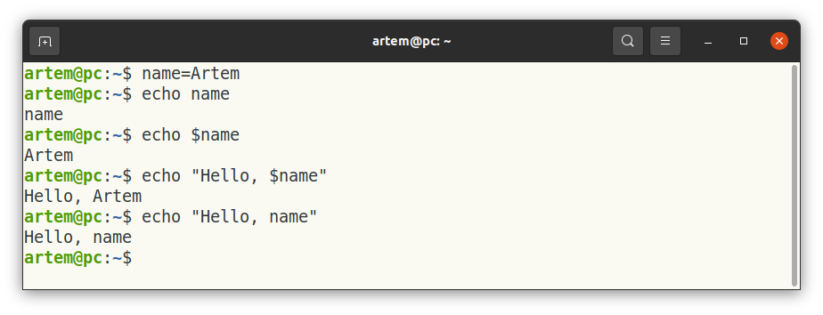
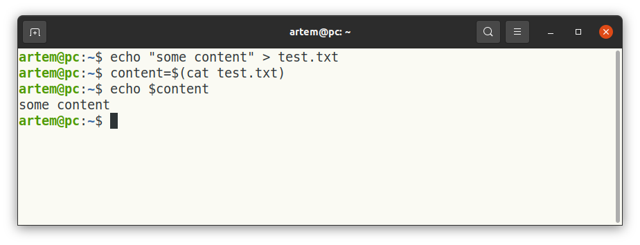
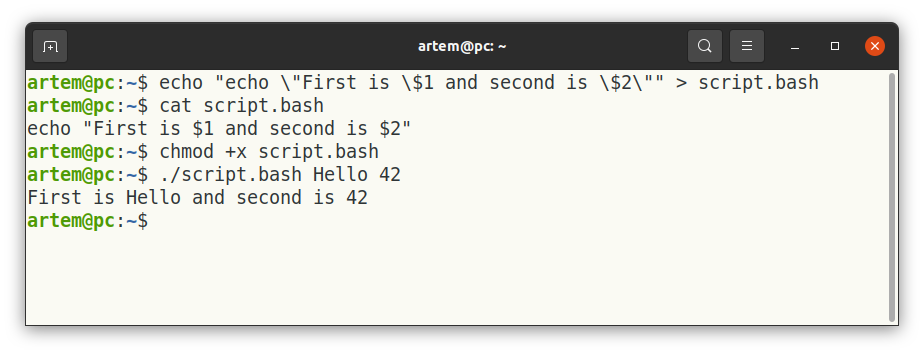
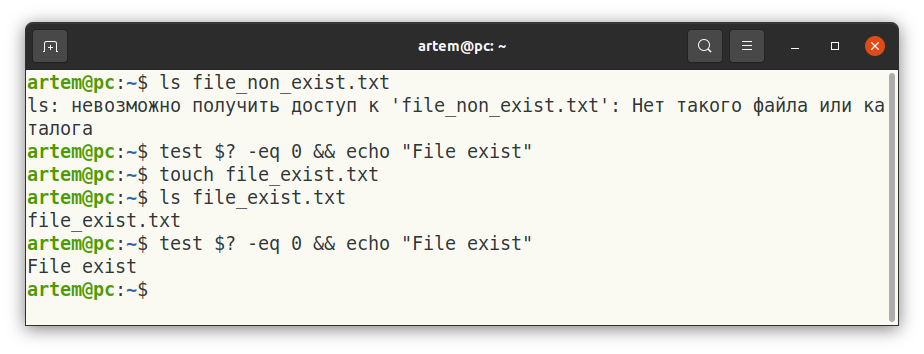

# Работа в командной строке

Команды bash являются неотъемлемой частью разработки. Командная строка, не только bash, но и другие, дает бОльшие возможности по сравнению с любым графическим интерфейсом. Любой интерфейс полагается на эти команды и вызывает их с соответствующими параметрами. 

## Мотивация

1. Относитесь к `bash` как универсальному скриптовому языку, который покажет одинаковое поведение на разных системах Линукс. С помощью bash и различных утилит мы можем получать доступ к "железу" машины на которой работаем и настраивать автоматические сценарии. Это так же возможно сделать и с использованием языков программирования, но сделать это будет сложнее и реализация будет зависеть от конкретного языка программирования. Но если мы напишем `bash` то "дернуть" его из любого языка программирования не составит труда, так как большинство из них поддерживает системные вызовы. Если же вызов системных функций невозможен или не удобен, обмен информацией всегда возможен через файлы, куда можно записать информацию из `bash` скрипта, а прочитать из `python`.


2. При работе на своей компьютере Вы можете не оценить все достоинства командной строки, однако она точно понадобиться, чтобы настроить работу вашего приложения на удаленном сервере физическом или виртуальном, к которому Вы будете подключаться по ssh и на котором в принципе может быть не установлено оконного интерфейса. 

Ниже будут описаны команды, которые помогут ходить по файловой системе, создавать, копировать и перемещать файлы, изменять разрешения для файлов, передавать владельца у файла, просматривать запущенные процессы и открытые порты.
Предположим что у нас есть пользователь с именем **artem**, на машине которая называется **pc**. Тогда при запуске командной строки мы увидим предложение ввода команды:

```bash
artem@pc:/$ 
```

Мы видим, что здесь указаны имя пользователя и имя компьютера через символ `@`, далее после двоеточия (`:`) указан текущий путь, сейчас мы находимся в корневой директории, далее символ `$` для отделения команды. Начнем изучение командной строки с команды, которая позволяет ходить по файловой системе. 

**Hint: при нажатии на стрелку вверх в командную строку будет подставлена предыдущая команда. Стрелку можно нажимать несколько раз**

**Hint: Дополнительные информацию и опции по каждой команде можно увидеть вызвав** `man command` **или** `command --help`, `man` **сокращенно от manual**

Мы надеемся, что это было достаточно убедительно, что бы не пройти мимо темы `bash`. 

## cd - change directory

Команда для смены директории. При вызове происходит переход в директорию, которая указана после команды `cd /path/to/destination`. Предположим что у нас есть пользователь с именем artem. Следующие команды можно выполнить чтобы перейти сначала в директорию `home` а затем в домашнюю директорию пользователя `/home/artem`:
```bash
artem@pc:/$ cd /home
artem@pc:/home$ cd ./artem
artem@pc:~$
```
Заметьте что во втором случае мы использовали `./` для перехода по относительному пути. Так же видно что меняется текущий путь в котором мы находимся: в первой строке это была корневая директория (`/`), во второй - директория, в которой содержаться все домашние директории всех пользователей данной системы (`/home`). В третьей строке вместо пути мы видим символ `~`, который является сокращением для домашней папки конкретного пользователя. Две команды выше эквиваленты одной команде с указанием абсолютного пути:

```bash
artem@pc:/$ cd /home/artem
```

Команда `cd /artem` вызовет ошибку так как будет происходить поиск в корневой директории, а в ней **НЕ** содержится директории `artem`. 
При использовании `cd` можно использовать сокращения которые позволяет переходить по определенным путям не прописываю полный путь (в примерах ниже `#` означает начало комментария): 

```bash
    cd ~        # переход в домашнюю папку
    cd ../      # переход на один уровень выше
    cd ../../   # переход на два уровня выше, можно добавлять ../ чтобы уйти еще выше
    cd -        # возврат в предыдущую директорию
    cd .        # текущий каталог
```

На рисунке ниже представлено использование команд описанных выше.


При использовании команды `cd` можно не помнить полное наименование директории. Можно начать писать путь и затем нажать на TAB для автодополнения пути. 

```bash
artem@pc:/$ cd /usr/loc     # нажимаем TAB
artem@pc:/$ cd /usr/local/
```
Если написанного пользователем будет недостаточно для того, чтобы однозначно определить путь, командная строка выдаст все возможные варианты:
```bash
user#pc: cd /usr/l     # нажимаем TAB
lib/    libexec/    local/
user#pc: cd /usr/l
```


Вопросы для проверки: 

*Что можно указать после команды cd?*  

* Абсолютный путь (верно) 
* Относительный путь (верно)
* Адрес веб-сайта (НЕверно)
* Один из специальных наборов символов, например `../` (верно)

## ls - list 

Для просмотра содержимого директории можно использовать **ls**. При вызове без параметров будет показано содержимое *текущей директории*. Так же можно указать путь `ls /path/to/dir`, в этом случае будет показано содержимое *указанной директории*.


Мы видим что разные имена подкрашены по разному, на картинке выше мы видим три вида разметки. В вашей командой строке цвета могут отличаться, на картинке синий обозначает директорию, черный обычный файл и зеленый исполняемый файл. Но как понять это без цветовой индикации. Для этого вызовите `ls -l`:


Теперь мы видим больше информации по каждому файлу и директории в `project`. Среди этой информации: разрешение, владелец, группа, размер, дата последнего изменения, имя файла. Теперь мы видим что директория имеет букву `d` в разрешениях, а исполняемый файл в отличие от неисполняемого имеет атрибут `x`. 

Для просмотра скрытых файлов нужно указать параметр `a`. К скрытым файлам относится директории которые создаются при инициализации репозитория git.


Вопросы для проверки: 

*Можно ли указывать ls без параметров*  

* Да (верно) 
* Нет (НЕверно)

## clear 

Командой **clear** можно очистить терминал от вывода, при этом история команд останется, и их по-прежнему можно доставать нажимая на стрелку вверх. 


При использовании clear мы увидим пустой терминал:


> PS: для скриншотов данного материала `clear` использовалось ооочень много раз :)

## mkdir - make directory

Для создания директорий мы используем команду **mkdir**. Так же как в случае с **cd** и **ls** мы можем использовать относительный путь. Если директория уже существует будет выдано сообщение об ошибке


## touch

Представьте ситуацию когда нужно посмотреть время когда последний раз запускалось то или иное приложение, которое запускается в фоне. Существует множество способов как это можно сделать, запись в базе данных, анализ логов и так далее. Самой простой способ для bash-скрипта будет изменение времени последнего изменения какого-либо файла. Это можно сделать записав что-то в файл, но если такой вариант не подходит, то можно воспользоваться командой `touch`, которая как раз предназначена для изменения времени обращения к файлу на текущее, при этом открытие файл не происходит. 


Если файл не существует он будет создан пустым, если не указан аргумент `-с`.


## cat - concatenate

Читает содержимое файлов и выводит его. Добавим в project директорию `data` и два файла `items_part1.txt` и `items_part2.txt`.


Можно `cat` использовать для склеивания содержимого нескольких файлов, укажите несколько файлов после cat затем `>>` и имя файла в который нужно слить данные. Символы `>>` означают перенаправление потока, т.е. мы делаем вывод не стандартный поток, а например в файл.


С помощью cat можно пронумеровать строки в файлах сквозной нумерацией.


**Hint: посмотрите также команды `head` и `tail`, они выводят начало и конец файлов. `tail` будет удобен для просмотра журнала логов.**

**Hint: `>>` и `>` перенаправляют поток, и создают файл если его нет. Отличие состоит в том, что `>>` добавляет новое содержимое в конец файла, а `>` перезаписывает файл, удаляя предыдущее содержимое этого файла.**

## echo

Обычно используется в скриптах для вывода информации (как `print` в `python`). Так же с помощью **echo** можно записать строку в файл, если файла не было он будет создан.


## export

Используется для установки переменных среды. Команда `export` отмечает переменную окружения для экспорта с любым новым дочерним процессом, и это позволяет дочернему процессу наследовать все отмеченные переменные. Они нам понадобятся для того, чтобы использовать ту информацию, которую мы не хотим прописывать в коде приложения, например параметры доступа. Хардкодить такие значения не удобно, так как можно случайно закоммитить их, и придется все менять. Например так сделано в проекте по созданию [чат-бота](https://github.com/gcatanese/SampleTelegramQuiz), посмотрите секцию **Setup** в README. Ниже приведен пример использования `export`


Подробнее с вариантами использования `export` можно [здесь](https://www.digitalocean.com/community/tutorials/export-command-linux). 

## $ 

Есть несколько конструкций в которые входит `$`. Это может путать но если относиться к этим конструкциями как к обособленными элементам `bash`, то это может стать легче к восприятию.

Символ `$` ставиться перед переменной для того чтобы получить ее значение. По умолчанию любое имя считает строкой.



При этом использование `$` внутри двойных кавычек и без них может вызвать разное поведение. Если в значении переменной содержаться специальные символы. Если `$` используется в двойных кавычках, то ее значение переменной будет выдено как есть. Если значение переменной используется без кавычек, то `bash` проведет интерпретацию специальных символов, например как ниже с `*`, которую мы использовали для поиска файлов по шаблону.

Другое использование `$` это запись вывода команды в переменную. В этом случае `$` используется совместно со скобками.



В `bash` нельзя просто так взять и выполнить математическую операцию. Для этого используется `$` совместно с двойными скобками.


Также `$` используется для получения значений аргументов переданных в скрипт. Можно считать что сама оболочка присваивает номера переменым вместо того чтобы именовать их. Это похоже на токак мы используем `sys.argv[N]` в `python` когда хотим получить то что передано при вызове нашей программs. 



Первая строка для того чтобы создать код скрипта, Вы можете вбить его в любом текстовом редакторе. Описание `chmod` смотрите ниже.

Есть еще один вариант использования `$` но на этот раз с фигурными скобками. Это назвается parameter expansion и позволяет произвести операции над значениями переменной перед и передать результат дальше. Ниже пример со строкой `name=ArtemVesnin` и срезами, а также со списком `name=(Artem Vesnin)` и обращением к элементам списка.


Так же существует специальная переменная `$?` куда записывается статус выполнения последней команды.

```bash
ls non_existent_file.txt
if test $? -ne 0 ; then
  echo "Error: File not found or other issue occurred."
fi
```



Здесь мы использовали `test` для проведения операций сравнения. `-eq` сокращенно от equal. 

## rm - remove

Для удаления файлов используется команда **rm**. Удалить можно один файл, указав путь до него, или несколько, указав ту часть пути, которая может меняться через `*`, т.е. задав шаблон в который должны вписаться пути.


Удаление каталогов требует дополнительных опций, так как удаляется не отдельные файлы, а все содержимое каталога, поэтому нужно делать это рекурсивно заходя во все вложенные каталоги.


## rmdir - remove directory

Удаление пустых директорий или группы вложенных пустых директорий. 


Обратите внимание на сообщение об ошибке (вообще всегда смотрите на результат ваших действий, что понимать выполнилась ли команда). Часть работы была сделана: удалены директории `./a/b` и `./a`. А самый верхний уровень этого пути (`.`) это как мы помним текущая директория т.е. `~/project/data`, и rmdir сам ограничивает пользователя от того чтобы удалить директорию в которой он находится. Правильным будет `mkdir -p a/b`, хотя в большинстве случаев ./a/b и a/b равнозначны.


## cp - copy

Копирует один или несколько файлов из одного места в другое. Так же как и в случае с `rm` можно указывать шаблон, которому должны удовлетворять пути. 


## mv - move

Перемещает один или несколько файлов из одного места в другое. Так же как и в случае с `rm` можно указывать шаблон, которому должны удовлетворять пути. 


`move` можно использовать для переименования файлов.


## chmod - change mode

Изменяет разрешения файлов и директорий. Помните на рисунке, который уже был выше, `script.bash` подсвечивался зеленым, что означало что у него есть разрешение на исполнение. Давайте удалим его. Создадим скрипт заново и запишем туда строку `ls -l` с помощью `echo`, попробуем выполнить, получим ошибку, потом попробуем дать разрешение на исполнение и выполним еще раз.


Разрешения делятся на три категории `r` - чтение, `w` - запись, `x` - исполнение. А также на три уровня: владелец, группа, все остальные. Например `-rwxr-xr--`, означает что владелец может читать, писать и исполнять файл, пользователи из группы только читать и исполнять, все остальные только читать.
 
Разрешения делятся на три категории:
- **`r`** *(read)* - чтение; 
- **`w`** *(write)* - запись; 
- **`x`** *(execute)* - исполнение. 

А также на три уровня: 
1. Владелец файла или директории.
2. Группа пользователей, к которой принадлежит владелец.
3. Все остальные. 

Рассмотрим символьное представление прав доступа.
к примеру права доступа: `[drwxrwxrwx]` дают полный доступ на чтение, редактирование и запуск абсолютно всем пользователям. Рассмотрим этот случай подробнее. Ключи доступа из примера можно поделить на 4 секции: 1-`[d]` 2-`[rwx]` 3-`[rwx]` 4-`[rwx]`

1 секция может быть либо «d»- директория, либо «-» — файл.
2 секция показывает права доступа владельца файла или директории (r-чтение, w-запись, x- выполнение).
3 секция показывает права доступа группы в которой находится владелец, rwx — аналогично.
4 секция показывает права доступа всех остальных пользователей системы.

Например `-rwxr-xr--`, означает что владелец может читать, писать и исполнять файл, пользователи из группы только читать и исполнять, все остальные только читать. Можно не давать вообще разрешений, например `-rwxr-x---` запретит доступ к файлу всем пользователям, кроме его владельца (того кто создал этот файл) и участникам группы к которой он относится.

> Все группы, созданные в системе, находятся в файле /etc/group. Посмотрев содержимое этого файла, вы увидите список групп linux, которые уже есть в вашей системе. Этот список может быть большим и мало информативным для рядового пользователя. Чтоб вывести список всех групп, членом которых является текущий пользователь можно использовать команду `groups`.


## sudo - super user do

В большинстве случае для выполнения команд описанных выше достаточно обычных прав которые имеются у пользователя. Но в ряде случаев, при использовании системных утилит или смены владельца у файла (см. `chown` ниже), необходимо использовать права суперпользователя. Первый способ это авторизоваться используя аккаунт суперпользователя в системе. Но такой сценарий не является предпочтительным так может привести у случайному выполнению команды, которая может нанести вред системе. Более широкое применение получил способ, при котором для выполнения команды с правами суперпользователя, перед командой добавляется **`sudo`**. Ниже представлен пример передачи владение скрипта пользователю root, после этого не мы не сможем выполнять скрипт только от имени нового владельца т.е. `root` (для текущих разрешений скрипта `-rwxrwxr--`).


## chown - change owner

Изменяет владельца файла или директории. При этом если Вы хотите сделать это рекурсивно для всех файлов внутри директории, нужно указать специальный флаг `-R` для рекурсивной работы. При использовании мы указываем имя пользователя и группу через двоеточие `username:group`. Каждый пользователь может состоять в одной или нескольких группах. Можно менять владельца и не менять группу. В примере ниже мы вернули владение группе `artem` и теперь мы можем запускать файл от обычного пользователя (для текущих резрешений скрипта `-rwxrwxr--`)


## history 

Выводит историю выполненных команд.


## grep - global regular expression print

Производит поиск строки в тексте, содержащие определенную подстроку. При этом текст можно получить прямо из стандартного вывода или из файла. Бывает полезным, чтобы вспомнить как выполнялась та или иная команда в `bash`. 


Так же можно облегчить себе поиск документации по `man`, если примерно помнить термин.


Или найти что-нибудь в документе который Вы читаете:


**Hint: `|` перенаправляет выходной поток от одной команды к входу другой. Можно использовать чтобы миновать запись в файл на диске.**

## top - table of process

Выводит активные процессы а также информацию по загрузке процессора и памяти. Информация будет обновляться в терминале, чтобы выйти из этого режима нажмите `Cntl-C`. 


**Hint: `htop` дополняет функциональность `top`. Поставьте `htop` через менеджер пакетов, который используется в Вашем дистрибутиве (`sudo apt install htop` в Ubuntu).**

## Практические примеры

Нижем мы рассмотрим несколько примеров использования `bash` и еще раз повторим написанное в мотивации к этому уроку: рассматривайте `bash` как дополнительный инструмент, который может облегчить решение некоторых задач. Ради тренировки можно написать, например калькулятор, но его легко сделать на вашем любимом языке программирования гораздо быстрее, поэтому ниже мы рассмотрим примеры, которые используют доступ к системным утилитам и позволяет нам получить информации о подключенных устройствах и их состоянии.

### Мониторинг подключения usb устройств

Ниже приведены пример скрипта отслеживающего подключение и отключение usb-устройства:

```bash
#!/bin/bash

# Define the log file path
LOG_FILE="./usb-monitor.log"

# Get the initial list of connected USB devices
initial_devices=$(lsusb)

# Function to log the events
log_event() {
    local event_time="$(date +'%Y-%m-%d %H:%M:%S')"
    local event_type="$1"
    local device_id="$2"

    echo "$event_time | $event_type | $device_id" >> "$LOG_FILE"
}

# Function to check for new devices
check_devices() {
    while true 
    do
        current_devices=$(lsusb)
        echo "$initial_devices" | sort > "./idev.txt"
        echo "$current_devices" | sort > "./cdev.txt"
        new_devices=$(comm -13 "./idev.txt" "./cdev.txt")
        removed_devices=$(comm -13 "./cdev.txt" "./idev.txt")
        if test "$new_devices" != ""
        then
            for device in "$new_devices"; do
                log_event "connected" "$device"
            done
        fi
        if test "$removed_devices" != ""
        then
            for device in "$removed_devices"; do
                log_event "disconnected" "$device"
            done
        fi
        initial_devices=$current_devices
        sleep 1  # Adjust the update interval as needed
    done
}

# Start monitoring, just call check_devices()
check_devices
```


Мы видим ряд конструкций, которые доступны в обычном языке программирования, например условные операторы, циклы, функции. Реализация их в `bash` имеет свои особенности, но понять их синтаксис не сложно, если вы знаете хотя бы один язык программирования. Вызов функции так же обладает особенностью, например мы передаем аргументы не в скобках а после вызова функции. Особенности использования `$` мы рассмотрели выше. 

В скрипте мы используем новую команду `comm`, которая сравнивает два файла и выводит результат в три колонки, вторая из которых это строки уникальные для второго файла (что находится в других колонках можно посмотреть в документации `man comm`). Аргументы `-13` удаляют колонки 1 и 3 оставляя только вторую. Поэтому мы меняем файлы местами что определить `new_devices` и `removed_devices`. Функция `log_event()` записывает информацию о новых или отключенных устройствах в файл. Обратите внимание на вызов `check_devices` в конце скрипта. 

Мы проверяем устройства каждую секунду `sleep 1` поэтому при быстром подключении и отключении можем потерять информацию о событии. Далее мы рассмотрим пример того, как можно этого избежать.

Так же мы использовали команду `test` которая производит сравнение аргументов с использовании логических операторов. Вы можете встреть `["$new_devices" != ""]` вместо `test "$new_devices" != ""`, это одно и тоже. 

### Мониторинг подключения устройств с помощью dmesg

Выше мы рассмотрели скрипт для мониторинга usb устройств с помощью `lsusb`. В Линукс есть команда для мониторинга всех сообщений, которые появляются в системе. Мы можем настроить шаблоны, которые позволят нам отфильтровать нужные нам сообщения. Ниже приведен пример, которые позволит отловить все сообщения, где встречается подстрока "usb". При этом в отличие от скрипта с `lsusb` мы более защищены от потери события так как dmesg выводит сообщения из буфера, который хранит не только последнее сообщение, но и историю сообщений.

```bash
#!/bin/bash
prev_records=$(dmesg | tail -20)
 
monitor_devices_records() {

    while true
    do
        curr_records=$(dmesg | tail -20)
        new_records=$(comm -13 <(echo "$prev_records") <(echo "$curr_records"))
        usb_records=$(echo "$new_records" | grep usb)
        if test "$usb_records" != ""
        then
            echo "$usb_records"
        fi
        prev_records=$curr_records
    done
}
# Start monitoring
monitor_devices_records

```

### Мониторинг оставшегося места на диске

Скрипт приведенный ниже мониторит доступное на диске место и предупреждает когда процент занятого места превышен. Конструкцию `${}` мы описывали выше. Из нового мы видим конструкцию `($df_record)`, которая позволяет создать список из значения переменной `df_record`.


```bash
#!/bin/bash
monitor_device=$1  #device to monitor eg. /dev/sdc1
alert_level=$2     #available percentage to alert eg. 1
 
monitor_space_usage() {

    while true
    do
        df_record=$(df | grep "$monitor_device")
        df_record_array=($df_record)
        avail=${df_record_array[3]}
        total=${df_record_array[1]}
        if test $(( 100 * $avail / $total)) -le $alert_level
        then
            echo "Alert disk is almost full"
        fi
        sleep 1
    done
}

monitor_space_usage
```

## Задачи

В описании задач дается название утилит, которые можно использовать для ее решения. Предполагается, что вы самостоятельно найдете правильные параметры используя документацию `man имя_утилиты` или поиск в сети.

### Задача 1

Напишите скрипт, который будет делать резервную копию файла. Резервный файл должен содержать дату создания в имени.

**Ответ**

```bash
#!/bin/bash
file_to_backup="myfile.txt"
backup_file="backup_$(date +'%Y%m%d%H%M%S').txt"
cp "$file_to_backup" "$backup_file"
echo "Backup created: $backup_file"
```

### Задача 2

Напишите скрипт который удaлит файлы старше чем 30 дней в выбранной директории. Используйте утилиту `find` для поиска файлов. В пути до файлов, включая имя файлов, не должно быть пробелов и специальных символов. Для этой задачи предполагается, что пути содержат только латинские буквы, цифры, тире и подчеркивания.

**Ответ**

```bash
#!/bin/bash

# Define the directory to search in and the days threshold
directory="/path/to/directory"
days_threshold=30

# Store the output of the find command in a variable
found_paths=$(find "$directory" -type f -mtime +$days_threshold)

# Iterate through the paths and remove each file
for path in $found_paths; do
    rm "$path"
    echo "Deleted: $path"
done
```

### Задача 3

Напишите скрипт который будет мониторить использование памяти определенным процессом, например вашей программой и ежесекундно записывать в файл объем использованной памяти. Используйте утилиту `ps` для получения информации о процессе и `awk` для получения суммарного объема использованной памяти.

Cкрипт `memory_monitor.sh` написать так чтобы его можно было использовать как показано ниже:

```bash
# Launch your program (replace "./my_program" with the actual command to run your program)
./my_program &

# Capture the PID of the launched program
program_pid=$!

# Start the monitoring script with the captured PID as an argument
./memory_monitor.sh "$program_pid"
```

**Ответ**

```bash
#!/bin/bash

# File to store the memory usage data
output_file="memory_usage_log.txt"

# Header for the output file (if it doesn't exist)
if [ ! -f "$output_file" ]; then
    echo "Datetime Memory_Usage(KB)" > "$output_file"
fi

# Function to get memory usage of the process by PID
get_memory_usage() {
    local pid=$1
    local memory_usage=$(ps -o rss= -p "$pid" | awk '{ sum+=$1 } END { print sum }')
    echo "$memory_usage"
}

# Check if a process ID was provided as an argument
if test -z "$1" ; then
    echo "Usage: $0 <process_id>"
    exit 1
fi

# Main loop to monitor and log memory usage
while true; do
    datetime=$(date +"%Y-%m-%d %H:%M:%S")
    pid="$1"
    memory_usage=$(get_memory_usage "$pid")

    # Append data to the output file
    echo "$datetime $memory_usage" >> "$output_file"

    # Wait for 1 second before the next iteration
    sleep 1
done
```

### Задача 4

Напишите скрипт, который будет проверять доступность cайта. Это может пригодиться во многих приложениях, когда происходит отправка данных или работоспособность одного приложения зависит от другого расположенного на другом сервере. Используйте утилиту `curl`, которая позволяет делать запросы.

**Ответ**

```bash
#!/bin/bash
website="https://example.com"
response=$(curl -Is "$website" | head -n 1)
if [[ "$response" == *"200 OK"* ]]; then
    echo "Website is reachable."
else
    echo "Website is down or unreachable."
fi
```

### Задача 5

Напишите скрипт для мониторинга портов открытых на удаленной машине. Для этого используйте утилиту `nc`.

**Ответ**

```bash
#!/bin/bash

# Remote website to check (replace example.com and 80 with the appropriate values)
remote_host="example.com"
port="80"

# Function to check if the port is open on the remote site
check_port_open() {
    local host=$1
    local port=$2
    nc -z -w5 "$host" "$port" >/dev/null 2>&1
    if [ $? -eq 0 ]; then
        echo "Port $port is open on $host"
    else
        echo "Port $port is closed or unreachable on $host"
    fi
}

# Call the function to check the port
check_port_open "$remote_host" "$port"
```


