# Работат в командной строке

Команды bash являются неотъемлемой частью разработки. Командная строка, не только bash, но и дургие, дает бОльшие возможности по сравнению с любым графическим интерфейсом. Любой интерфейс полагается на эти команды и вызывает их с соответствующими параметрами. 

**Мотивация:** При работе на своей компьютере Вы можете не оценить все достоинства командной строки, однако она точно понадобиться, чтобы настроить работу вашего приложения на удаленном сервере физическом или виртуальном, к которому Вы будете подключаться по ssh и на котором в принципе может быть не установлено оконного интерфейса. 

Ниже будут описаны команды, которые помогут ходить по файловой системе, создавать, копировать и перемещать файлы, изменять разрешения для файлов, передавать владельца у файла, просматривать запущенные процессы и открытые порты.
Предположим что у нас есть пользователь с именем **artem**, на машине которая называется **pc**. Тогда при запуске командной строки мы увидим предложение ввода команды:

    artem@pc:/$ 

Мы видим, что здесь указаны имя пользователя и имя компьютера через символ `@`, далее после двоеточия (`:`) указан текущий путь, сейчас мы находимся в корневой директории, далее символ `$` для отделения команды. Начнем изучение командной строки с команды, которая позволяет ходить по файловой системе. 

**Hint: при нажатии на стрелку вверх в командную строку будет подставлена предыдущая команда. Стрелку можно нажимать несколько раз**

**Hint: Дополнительные информацию и опции по каждой команде можно увидеть вызвав `man command` или `command --help`, `man` сокращенно от manual **

## cd - change directory

Команда для смены директории. При вызове происходит переход в директорию, которая указана после команды `cd /path/to/destination`. Предположим что у нас есть пользователь с именем artem. Следующие команды можно выполнить чтобы перейти сначала в директорию `home` а затем в домашнюю директорию пользователя `/home/artem`:

    artem@pc:/$ cd /home
    artem@pc:/home$ cd ./artem
    artem@pc:~$

Заметьте что во втором случае мы использовали `./` для перехода по относительному пути. Так же видно что меняется текущий путь в котором мы находимся: в первой строке это была корневая директория (`/`), во второй - директория, в которой содержаться все домашние директории всех пользователей данной системы (`/home`). В третьей строке вместо пути мы видим символ `~`, который является сокращением для домашней папки конкретного пользователя. Две команды выше эквиваленты одной команде с указанием абсолютного пути:

    artem@pc:/$ cd /home/artem

Команда `cd /artem` вызовет ошибку так как будет происходить поиск в корневой директории, а в ней НЕ содержится директории `artem`. 
При использовании `cd` можно использовать сокращения которые позволяет переходить по определенным путям не прописываю полный путь (в примерах ниже `#` означает начало комментария): 

    cd ~        # переход в домашнюю папку
    cd ../      # переход на один уровень выше
    cd ../../   # переход на два уровня выше, можно добавлять ../ чтобы уйти еще выше
    cd -        # возврат в предыдущую директорию
    cd .        # текущий каталог

На рисунке ниже представлено использование команд описанных выше.

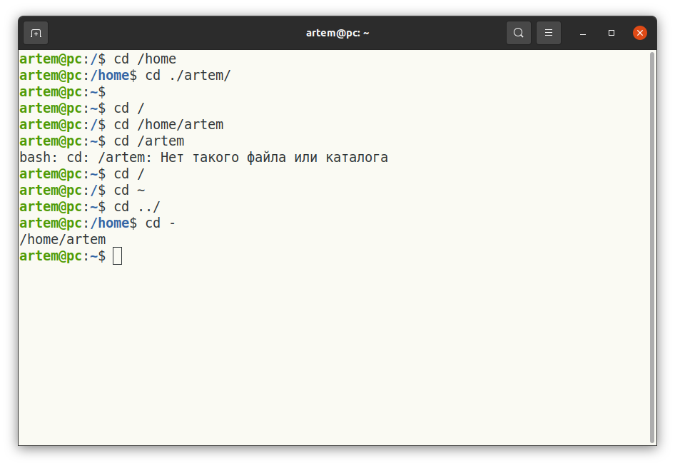

При использовании команды `cd` можно не помнить полное наименование директории. Можно начать писать путь и затем нажать на TAB для автодополнения пути. 

    artem@pc:/$ cd /usr/loc     # нажимаем TAB
    artem@pc:/$ cd /usr/local/

Если написанного пользователем будет недостаточно для того, чтобы однозначно определить путь, командная строка выдаст все возможные варианты:

    user#pc: cd /usr/l     # нажимаем TAB
    lib/    libexec/    local/
    user#pc: cd /usr/l

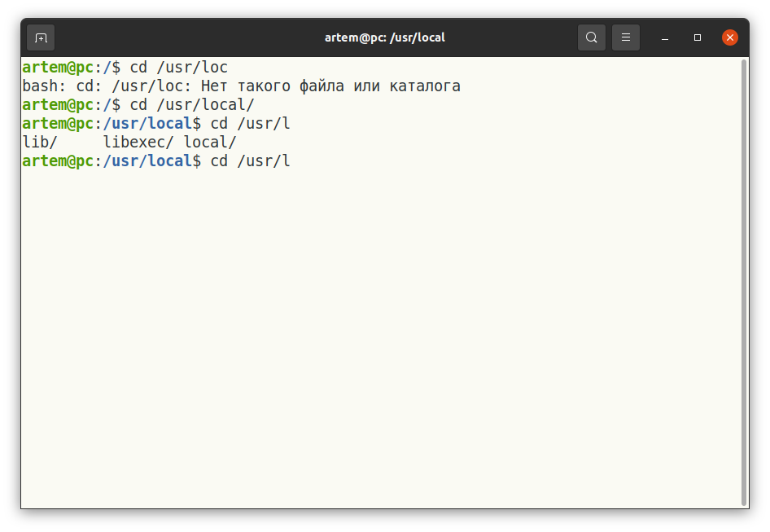

Вопросы для проверки: 

*Что можно указать после команды cd?*  

* Абсолютный путь (верно) 
* Относительный путь (верно)
* Адрес веб-сайта (НЕверно)
* Один из специальных наборов символов, например `../` (верно)

## ls - list 

Для просмотра содержимого директории можно использовать **ls**. При вызове без параметров будет показано содержимое *текущей директории*. Так же можно указать путь `ls /path/to/dir`, в этом случае будет показано содержимое *указанной директории*.

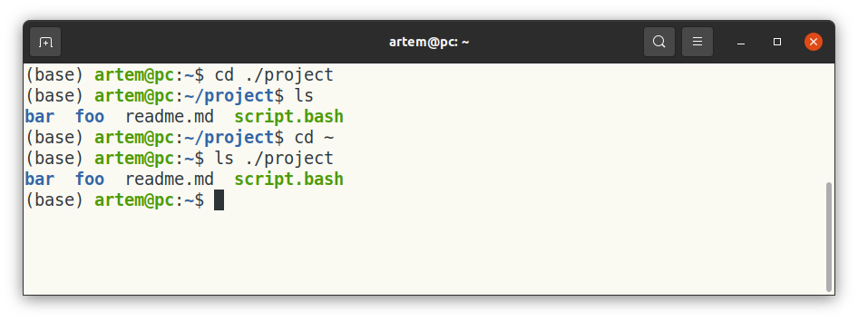

Мы видим что разные имена подкрашены по разному, на картинке выше мы видим три вида разметки. В вашей командой строке цвета могут отличаться, на картинке синий обозначает директорию, черный обычный файл и зеленый исполняемый файл. Но как понять это без цветовой индикации. Для этого вызовите `ls -l`:

Теперь мы видим больше информации по каждому файлу и директории в `project`. Среди этой информации: разрешение, владелец, группа, размер, дата последнего изменения, имя файла. Теперь мы видим что директория имеет букву `d` в разрешениях, а исполняемый файл в отличие от неисполняемого имеет атрибут `x`. 

Для просмотра скрытых файлов нужно указать параметр `a`. К скрытым файлам относится директории которые создаются при инициализации репозитория git.

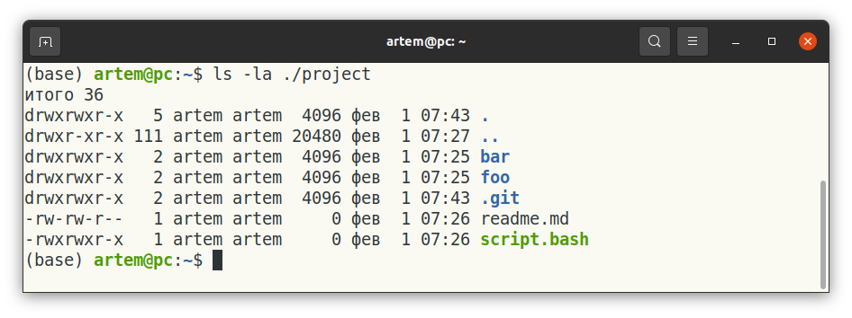

Вопросы для проверки: 

*Можно ли указывать ls без параметров*  

* Да (верно) 
* Нет (НЕверно)

## clear 

Командой **clear** можно очистить терминал от вывода, при этом история команд останется, и их по-прежнему можно доставать нажимая на стрелку вверх. 

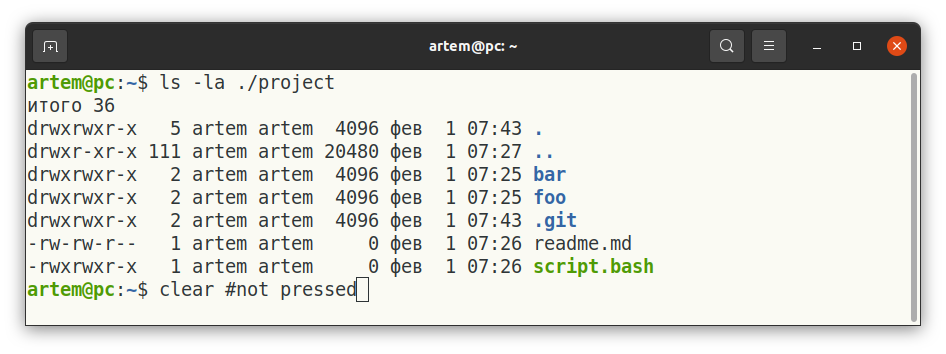

При использовании clear мы увидим пустой терминал:

PS: для скриншотов данного материала `clear` использовалось ооочень много раз :)

## mkdir - make directory

Для создания директорий мы используем команду **mkdir**. Так же как в случае с **cd** и **ls** мы можем использовать относительный путь. Если директория уже существует будет выдано сообщение об ошибке

## touch

Представьте ситуацию когда нужно посмотреть время когда последний раз запускалось то или иное приложение, которое запускается в фоне. Существует множество способов как это можно сделать, запись в базе данных, анализ логов и так далее. Самой простой способ для bash-скрипта будет изменение времени последнего изменения какого-либо файла. Это можно сделать записав что-то в файл, но если такой вариант не подходит, то можно воспользоваться командой `touch`, которая как раз предназначена для изменения времени обращения к файлу на текущее, при этом открытие файл не происходит. 

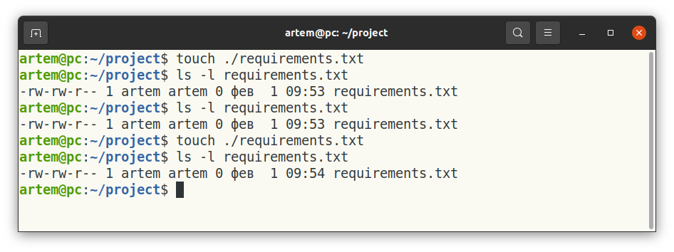

Если файл не существует он будет создан пустым, если не указан аргумент `-с`.

## cat - concatenate

Читает содержимое файлов и выводит его. Добавим в project директорию `data` и два файла `items_part1.txt` и `items_part2.txt`.

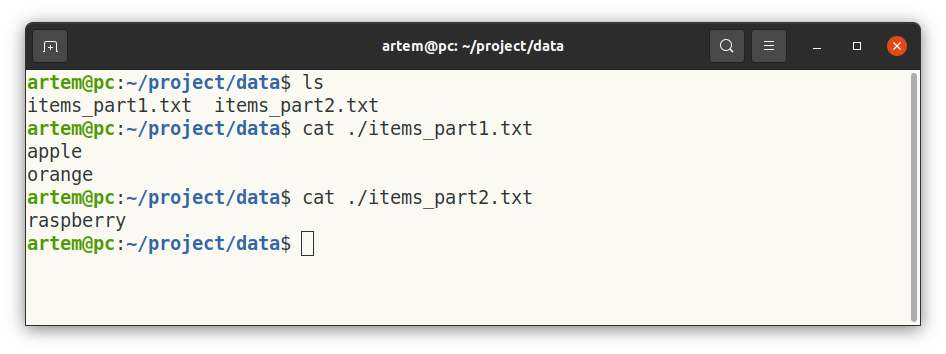

Можно `cat` использовать для склеивания содержимого нескольких файлов, укажите несколько файлов после cat затем `>>` и имя файла в который нужно слить данные. Символы `>>` означают перенаправление потока, т.е. мы делаем вывод не стандартный поток, а например в файл.

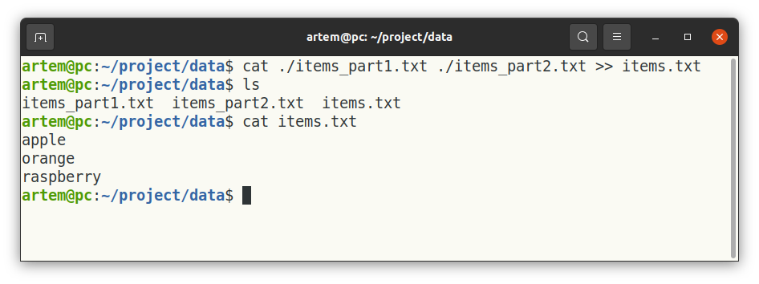

С помощью cat можно пронумеровать строки в файлах сквозной нумерацией.

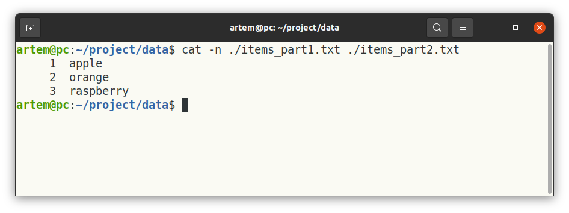

**Hint: посмотрите также команды `head` и `tail`, они выводят начало и конец файлов. `tail` будет удобен для просмотра журнала логов.**

**Hint: `>>` и `>` перенаправляют поток, и создают файл если его нет. Отличие состоит в том, что `>>` добавляет новое содержимое в конец файла, а `>` перезаписывает файл, удаляя предыдущее содержимое этого файла.**

## echo

Обычно используется в скриптах для вывода информации (как `print` в `python`). Так же с помощью **echo** можно записать строку в файл, если файла не было он будет создан.

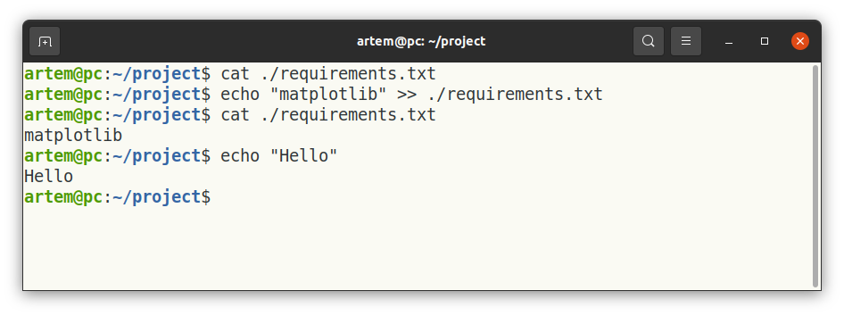

## rm - remove

Для удаления файлов используется команда **rm**. Удалить можно один файл, указав путь до него, или несколько, указав ту часть пути, которая может меняться через `*`, т.е. задав шаблон в который должны вписаться пути.

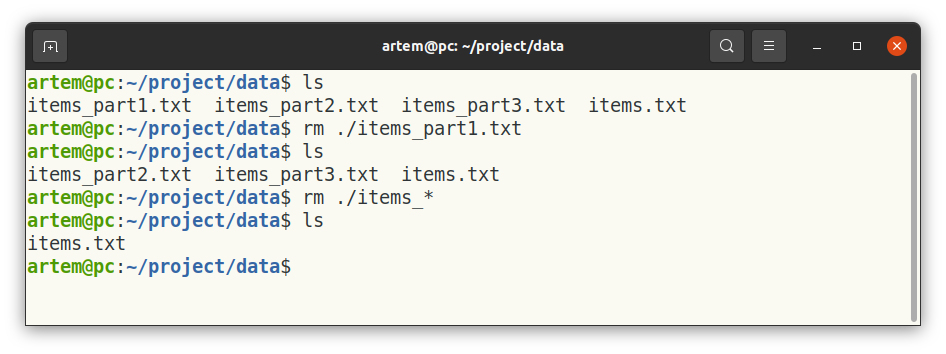

Удаление каталогов требует дополнительных опций, так как удаляется не отдельные файлы, а все содержимое каталога, поэтому нужно делать это рекурсивно заходя во все вложенные каталоги.

## rmdir - remove directory

Удаление пустых директорий или группы вложенных пустых директорий. 

Обратите внимание на сообщение об ошибке (вообще всегда смотрите на результат ваших действий, что понимать выполнилась ли команда). Часть работы была сделана: удалены директории `./a/b` и `./a`. А самый верхний уровень этого пути (`.`) это как мы помним текущая директория т.е. `~/project/data`, и rmdir сам ограничивает пользователя от того чтобы удалить директорию в которой он находится. Правильным будет `mkdir -p a/b`, хотя в большинстве случаев ./a/b и a/b равнозначны.

## cp - copy

Копирует один или несколько файлов из одного места в другое. Так же как и в случае с `rm` можно указывать шаблон, которому должны удовлетворять пути. 

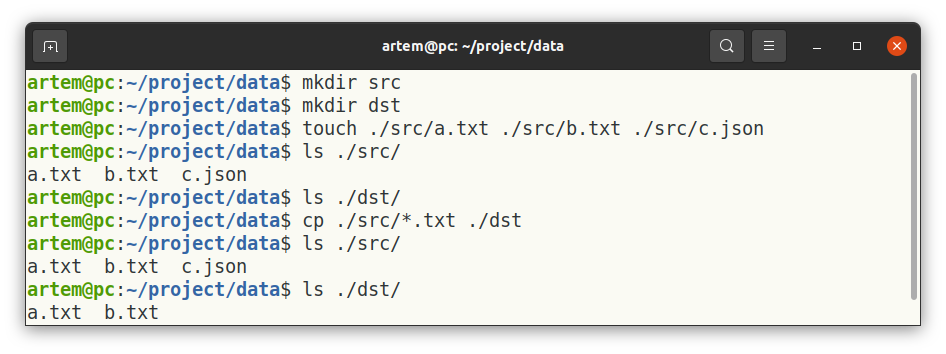

## mv - move

Перемещает один или несколько файлов из одного места в другое. Так же как и в случае с `rm` можно указывать шаблон, которому должны удовлетворять пути. 

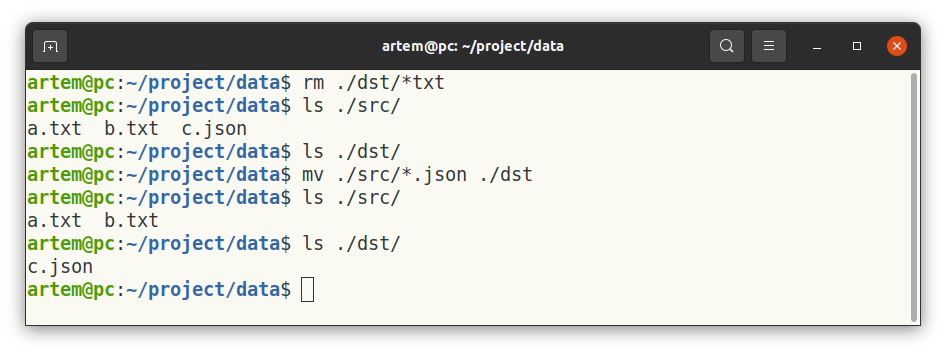

`move` можно использовать для переименования файлов.

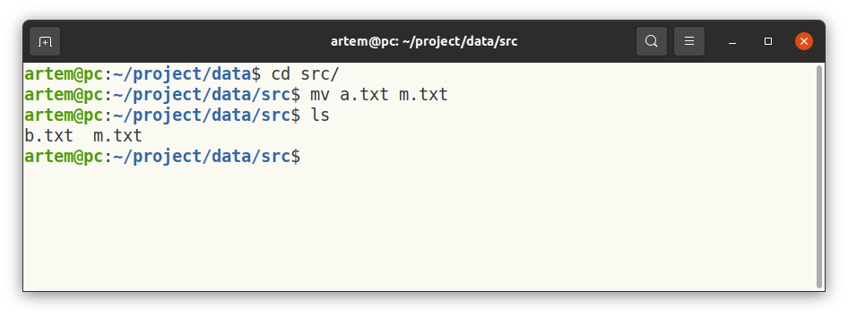

## chmode - change mode

Изменяет разрешения файлов и директорий. Помните на рисунке, который уже был выше, `script.bash` подсвечивался зеленым, что означало что у него есть разрешение на исполнение. Давайте удалим его. Создадим скрипт заново и запишем туда строку `ls -l` с помощью `echo`, попробуем выполнить, получим ошибку, потом попробуем дать разрешение на исполнение и выполним еще раз.

Разрешения делятся на три категории `r` - чтение, `w` - запись, `x` - исполнение. А также на три уровня: владелец, группа, все остальные. Например `-rwxr-xr--`, означает что владелец может читать, писать и исполнять файл, пользователи из группы только читать и исполнять, все остальные только читать. Можно не давать вообще разрешений, например `-rwxr-x---` будет 

## sudo - super user do

В большинстве случае для выполнения команд описанных выше достаточно обычных прав которые имеются у пользователя. Но в ряде случаев, при использовании системных утилит или смены владельца у файла (см. `chown` ниже), необходимо использовать права суперпользователя. Первый способ это авторизоваться используя аккаунт суперпользователя в системе. Но такой сценарий не является предпочтительным так может привести у случайному выполнению команды, которая может нанести вред системе. Более широкое применение получил способ, при котором для выполнения команды с правами суперпользователя, перед командой добавляется **`sudo`**. Ниже представлен пример передачи владение скрипта пользователю root, после этого не мы не сможем выполнять скрипт только от имени нового владельца т.е. `root` (для текущих разрешений скрипта `-rwxrwxr--`).

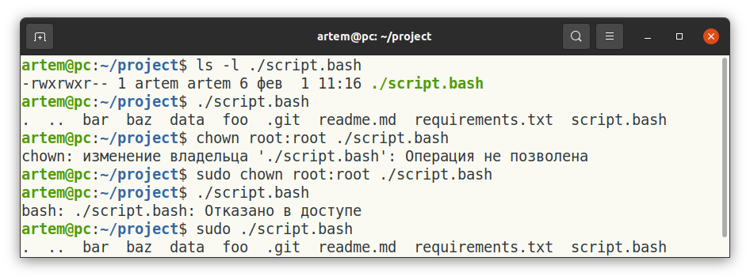

## chown - change owner

Изменяет владельца файла или директории. При этом если Вы хотите сделать это рекурсивно для всех файлов внутри директории, нужно указать специальный флаг `-R` для рекурсивной работы. При использовании мы указываем имя пользователя и группу через двоеточие `username:group`. Каждый пользователь может состоять в одной или нескольких группах. Можно менять владельца и не менять группу. В примере ниже мы вернули владение группе `artem` и теперь мы можем запускать файл от обычного пользователя (для текущих резрешений скрипта `-rwxrwxr--`)

## history 

Выводит историю выполненных команд.

## grep - global regular expression print

Производит поиск строки в тексте, содержащие определенную подстроку. При этом текст можно получить прямо из стандартного вывода или из файла. Бывает полезным, чтобы вспомнить как выполнялась та или иная команда в `bash`. 

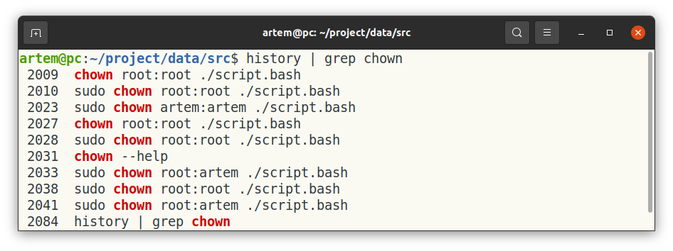

Так же можно облегчить себе поиск документации по `man`, если примерно помнить термин.

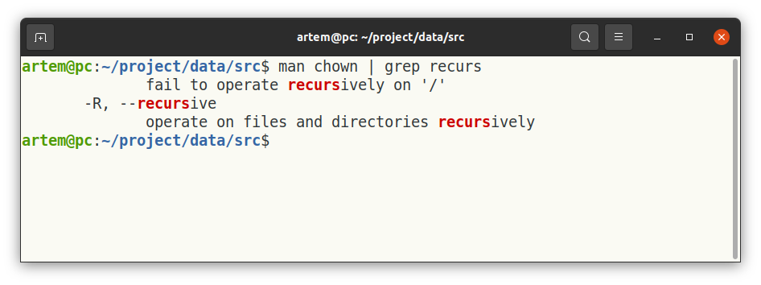

Или найти что-нибудь в документе который Вы читаете:

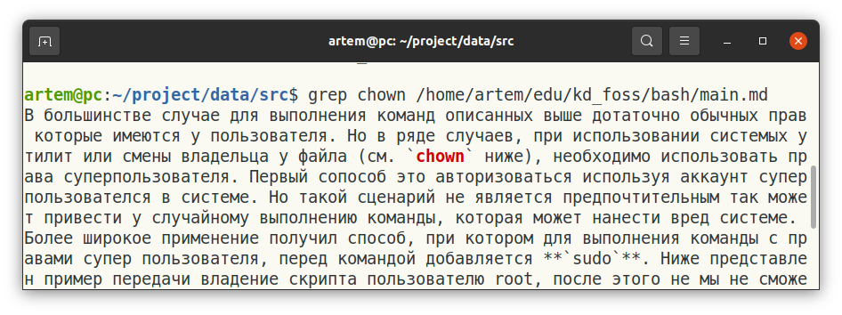

**Hint: `|` перенаправляет выходной поток от одной команды к входу другой. Можно использовать чтобы миновать запись в файл на диске.**

## top - table of process

Выводит активные процессы а также информацию по загрузке процессора и памяти. Информация будет обновляться в терминале, чтобы выйти из этого режима нажмите `Cntl-C`. 

**Hint: `htop` дополняет функциональность `top`. Поставьте `htop` через менеджер пакетов, который используется в Вашем дистрибутиве (`sudo apt install htop` в Ubuntu).**

*