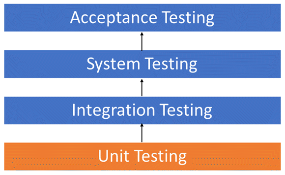
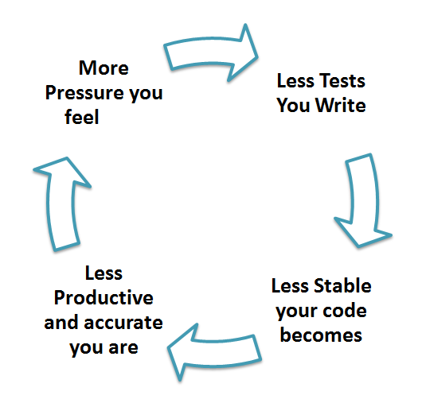

# Тестирование

Тестирование - это способ убедиться, что код делает то, что мы ожидаем от него. Существуют ручное и автоматическое тестирования. При ручном тестировании человек выполняет шаги из инструкции и фиксирует поведение приложения или кода. При автоматическом тесты выполняются специальным инструментом и собирается статистика пройденных или проваленных тестов. 
Зачем нужно ручное тестирование, когда автоматические тесты выглядят гораздо удобней - один раз написал и пользуйся? Ручные тесты с привлечением человека незаменимы, когда речь идет об апробации интерфейса. И в любых других задачах, когда сложно сформулировать критерии правильной работы. Здесь речь шла о готовом приложении, когда речь идет о коде, автоматическое тестирование незаменимо. Без автоматического тестирование невозможно было обеспечить [CI](https://www.atlassian.com/continuous-delivery/continuous-integration/how-to-get-to-continuous-integration)/[CD](https://aws.amazon.com/ru/devops/continuous-delivery/)(continuous integration/continuous delivery). CI/CD позволяют иметь оттестированную версию приложения в любой момент времени. 

## Мотивация

Существует несколько пунктов чтобы убедить себя что тесты это не пустая трата времени:

1. Первая очевидная функция это уменьшение вероятности возникновения ошибок в коде. Много мелких ошибок могут привести к серьезной проблеме и тесты призваны предотвратить появление таких ошибок в коде. Существует системы, которые будут автоматически проводить тестирование при загрузку кода в репозиторий, и это просто не даст разработчику залить не полностью рабочий код, но это возможно только при наличии автоматизированных тестов.

2. Этот пункт скорее психологический - у разработчика появляется инструмент, который подскажет ему если он ошибся. Разработчик тратить меньше внимания на возможность возникновения ошибок, ведь у него есть система тестов, и соответственно больше внимания уделяет написанию кода, более смело экспериментирует, ведь тесты подскажут ему если он сломал другой участок программы. Таким образом тесты способствуют более быстрой работе и появлению более интересных решений.

3. Тесты можно рассматривать как своего рода документацию: то как мы можем использовать функционал нашего приложения.
 
## Виды тестов

Выделяют несколько видов тестирования.

### Модульное тестирование

Модульное или unit-тестирование. Как видно из названия, мы тестируем отдельные модули или «единицы» (участки) кода. Модульные тесты наиболее близки к контексту конкретных функций или других логически обособленных участков кода. Отсюда вытекает одно из основных свойств модульных тестов - изолированность, если мы тестируем функцию `foo`, то там не должно быть участков связанных с функцией `bar`. Модульные тесты позволяют проверить отдельные части кода, прежде чем тестировать их совместно. 



Модульное тестирование:
  * может помочь при разработке: понимая, что каждый участок кода нужно будет протестировать отдельно, разработчик с большей вероятностью не будет создавать большие функции со смешанной логикой, а разобьет ту же функциональность на несколько маленьких функций, каждую из которых будет понятно, как протестировать. Это, в конечном счете, положительно влияет на то, как выглядит API библиотеки.
  * заставляет задуматься о входных данных, которые подаются на вход коду и лучше погрузиться в контекст решаемой задачи. 
  * позволяет протестировать часть кода, если в данный момент на другой частью работает другой человек и она не проходит все тесты.
  * покрытие тестами всех возможных вариантов зависит от разработчика.
  * позволяет реализовывать подход «пиши код и тестируй одновременно». Так модульные тесты по атомарны по природе, мы можем выделять новые ситуации непосредственно во время написания кода и облачать их в тест.
  * позволяет другим разработчикам убедиться, что у них все настроено правильно и можно продолжать разработку. Если тесты не проходят, значит, нужно остановиться и донастроить рабочее окружение.

Преимущества наличия модульных тестов в коде могут быть не очевидны сначала, но проблемы, которые копятся из-за отсутствия или недостаточного количества тестов, постепенно будут копиться и со временем, и в итоге мы перестанем писать новую функциональность, а будем только разбирать баги.




#### Пример 

Рассмотрим функции, которые генерируют последовательность N первых чисел целиком и отдельно четные и нечетные.

```python
#content of series.py in my_math package
def get_series(n):
    return list(range(n))
    
def get_even_series(n):
    series = get_series(n)
    even_series = [i * 2 for i in series]
    return even_series

def get_odd_series(n):
    series = get_series(n)
    odd_series = [i * 2 + 1 for i in series]
    return odd_series
```

Мы видим, что функции `get_even_series()` и `get_odd_series()` используют другую функцию `get_series()`. Это нормально и хорошо, когда есть возможность переиспользовать код в другом месте. Мы выделяем его в отдельный блок. Но все три функции должны быть протестированы без учета внутреннего устройства функции.

```python
#content of test_series.py
import pytest

from my_math.series import (get_series,
                            get_even_series,
                            get_odd_series)

class TestSeries:
    def test_series(self):
        assert get_series(5) == [0, 1, 2, 3, 4]

    def test_even_series(self):
        assert get_even_series(5) == [0, 2, 4, 6, 8]

    def test_odd_series(self):
        assert get_odd_series(5) == [1, 3, 5, 7, 9]

    # test include the same code as in the function implementation
    def test_even_series_bad(self):
        n = 5
        even_series = [i * 2 for i in get_series(n)]
        assert get_even_series(n) == even_series
    
    # test include several functions that can be tested separetely
    def test_all_series_bad(self):
        n = 5
        assert get_series(n) == [0, 1, 2, 3, 4]
        assert get_even_series(n) == [0, 2, 4, 6, 8]
        assert get_odd_series(n) == [1, 3, 5, 7, 9]
        
    # might be a good test
    def test_series_full(self):
        series = get_even_series(5) + get_odd_series(5)
        series.sort()
        assert get_series(10) == series
```

Давайте разберемся, что мы здесь видим. Тесты `test_series`, `test_even_series`, `test_odd_series` тестируют отдельно функциональность трех разных функций, поэтому это нормальные юнит-тесты. Мы можем написать генератор данных вместо использования фиксированных списков `[0, 1, 2, 3, 4]` и таким образом увеличить покрытие тестами. Мы вернемся к этому чуть позже, сейчас посмотрим на другие тесты. Тест `test_even_series_bad` не является хорошим тестом, так как мы используем ту же логику, что и при реализации функции, и если этот код будет немного сложнее, чем генерация списка чисел, то мы можем унести ошибку в тест, и он будет пройден, хотя функция работает не так, как закладывалось, например, если нужно было генерировать числа, начиная с нуля, а мы генерируем с 1 `range(n) -> range(1, n)`. Тогда `test_series_should_fail_but_passed()` ниже не вызовет ошибок, так как мы просто скопировали код из функции. Тест `test_series` не пройдет, так как здесь данные сгенерированы независимо, и так мы поймем, что сделали ошибку:

```python
#content of series.py in my_math package
def get_series(n):
    return list(range(1, n))                        # we made mistake 

#content of test_series.py
import pytest

from my_math.series import (get_series)

class TestSeries:
    def test_series(self):
        assert get_series(5) == [0, 1, 2, 3, 4]

    def test_series_should_fail_but_passed(self):
        assert get_series(5) == list(range(1, n))   # and propagate it here
```

Посмотрим на тест `test_series_full`. Он включает в себя вызов нескольких функций, это может быть хорошей идеей, так как мы проверяем полноту данных. Такой тест не должен подменять собой другие тесты, где мы тестируем отдельные функции, но может дополнять их. Тест не настолько объемный, чтобы считаться **интеграционным тестом**, хотя он и объединяет несколько отдельных участков кода и говорит, как они должны работать совместно.

#### Параметризация тестов

В тестах выше мы использовали заранее определенные списки, которые были захрадкожены прямо в тесте. Мы можем расширить функциональность тестов, используя [параметризацию](https://docs.pytest.org/en/7.1.x/example/parametrize.html) тестов. Добавим в `test_series.py` тесты, которые принимают параметр: 

```python
import pytest

from my_math.series import (get_series,
                            get_even_series,
                            get_odd_series)

class TestSeries:
    def test_series_parametrized(self, max_number):
        i = 0
        series = list()
        while i < max_number: 
            series.append(i)
            i = i + 1
        assert get_series(max_number) == series
```

И если мы попытаемся выполнить тесты, получим ошибку:

```bash
      def test_series_parametrized(self, max_number):
E       fixture 'max_number' not found
```

Мы видим новый термин `fixture`. В самом деле не понятно, откуда pytest должен узнать, что подставить вместо `max_number` при автоматическом тестировании. Если добавить max_number значение по умолчанию, то ошибки не будет, но это не то, что мы хотим сделать. Значения `max_number` должны быть каким-то образом определены и в pytest для этого используются `fixture`, которые хранят данные, которые используются в тестах. Мы определяем `fixture` в файле `conftest.py` и они будут доступны всем тестами. Эти данные определяются в отдельном файле, так как вызов функции отличается от вызовов тестов, и определение входных данных для тестов можно отнести конфигурированию тестов `conftest -> confifure test`. Добавим в `conftest` следующие строки:

```python
import pytest 

@pytest.fixture
def max_number():
    return 5
```

Теперь проходят все тесты. Теперь посмотрим, как можно сделать вызов теста с разными параметрами. Заменим с: 

```python 
def pytest_generate_tests(metafunc):
    if "max_number" in metafunc.fixturenames:
        # end can be retrived from command line parameters
        end = 10    
        metafunc.parametrize("max_number", range(end))
```

Имя параметра, который мы хотим менять, - `max_number`, а `range(end)` задает диапазон значений. Здесь на первый взгляд происходит небольшая магия, но это то, как работает pytest с параметризованными тестами и такие конструкции мы просто берем из документации. Функция `pytest_generate_tests` вызовется для каждого теста, далее мы посмотрим, что среди параметров-fixture есть тот, который нам нужен, и с помощью  `metafunc.parametrize()` сделаем из одного теста несколько, подставляя вместо одного значения диапазон значений `range(end)`. Значение `end` на текущий момент задано жестко, но может управляться при [запуске тестов](https://docs.pytest.org/en/7.1.x/example/simple.html#dynamically-adding-command-line-options). 

**Модульное тестирование позволяет понять, как части кода работают сами по себе**

## Интеграционное тестирование

Чтобы сделать интеграционное тестирование, нужно написать такие тесты, когда различные блоки, модули или компоненты программного приложения тестируются вместе. Интеграционное тестирование нужно для того, чтобы проверить ситуации, которые могут ускользнуть при юнит-тестировании. Основное отличие интеграционного теста от юнит-теста в том, что инициализируются все компоненты системы. Для юнит-теста мы можем определить тестовые данные непосредственно в тесте или через `fixture`. Для интеграционного теста мы положим такие же данные в базу данных и затем возьмем оттуда. Для интеграционного тестирования могут применяться как те же инструменты, как и для модульного тестирования, например pytest, так и специальные инструменты, которые протестируют приложение с внешней стороны, например, подадут тестовый запрос так, как бы это делал пользователь, что можно сделать с помощью [Selenium](https://www.techtarget.com/searchsoftwarequality/tip/Cypress-vs-Selenium-Compare-test-automation-frameworks). Подробнее про тестирование можно прочитать [здесь](https://www.techtarget.com/searchsoftwarequality/definition/integration-testing) или [здесь](https://docs.pylonsproject.org/projects/pyramid/en/latest/narr/testing.html).

**Интреграционное тестирование позволяет понять, как части кода и целые модули работают в контексте всей системы**

## Больше тестов 

Существует также системное тестирование, на этапе которого проверяются не только правильная функциональность частей системы, но и такие аспекты как: 

  * [работа под нагрузкой](https://www.guru99.com/load-testing-tutorial.html), 
  * [удобство использования](https://www.guru99.com/usability-testing-tutorial.html), 
  * [обеспечение совместимости](https://www.guru99.com/regression-testing.html) с предыдущими версиями кода. Это не совсем то же самое, что прохождение юнит-тестов, здесь мы тестируем, что новая версия программы работает с данными так же, как старые. Даже с учетом того, что юнит-тесты не принято менять в процессе добавления новой функциональности.
  * [восстановление](https://www.guru99.com/recovery-testing.html) работы системы при авариях.
  * [миграционное](https://www.winwire.com/blog/data-migration-testing/) тестирование, при котором мы тестируем «переезд» на другие инструменты.

В этой главе мы не будем подробно останавливаться на этих тестах, так как это делается не только силами разработчиков, для целей данного курса мы подробно остановились на модульном тестировании. 

## Разработка через тестирование

TDD - test-driven development, разработка через тестирование. Выше мы сначала писали функциональность и затем придумывали тесты. В подходе TDD мы сначала пишем тесты и затем делаем так, чтобы разработанная нами функциональность проходила все тесты. Для разработки через тестирование требуется создать автоматизированные модульные тесты, как мы делали выше с помощью `pytest`, которые определяют требования к коду непосредственно перед написанием самого кода. Тест содержит проверки условий, которые могут либо выполняться, либо нет. Такие условия начинаются с ключевого слова `assert` в примерах выше. Когда они выполняются, говорят, что тест пройден. Прохождение теста подтверждает поведение, которые программист предполагает правильным. 

Цикл разработки через тестирование (на основе книги Кента Бека «Разработка через тестирование: на примере»):

  * **Добавление теста**. Добавление каждой новой функциональности начинается с написания теста. Только что написанный тест не будет проходить проверку, потому что код, который он тестирует, ещё не написан (да, именно так). Если этот тест прошел проверку до написания кода, то данная функциональность уже реализована, либо же тест работает неправильно. Для написания теста разработчик должен четко понимать требования к новой функциональности - это и отличает TDD подход от остальных, разработчик фокусируется на требованиях до написания кода.
  * **Запускаем все тесты, убеждаемся, что они не прошли**. На этом этапе мы проверяем сами тесты. Если написанный тест проходит всегда - значит, он бесполезен. Это увеличивает уверенность, хотя не гарантирует, что тест действительно тестирует то, что нам нужно.
  * **Пишем код**. На этом этапе пишем код так, чтобы он проходил тесты. Этот код не обязан быть идеальным. Код может быть некрасивым, это мы поправим на следующих этапах.  Главное, чтобы код был предназначен для прохождения этого теста. Не следует добавлять лишнюю функциональность, для которой не написан тест.
  * **Запускаем тесты, убеждаемся, что они проходят**. Если тесты прошли - программист может быть уверен, что код удовлетворяет всем требованиям, определенным на этапе добавления теста, но не более. Если нет - переписываем код и повторно прогоняем тесты до тех пор, пока тесты не будут выполнены.
  * **Рефакторинг**. Теперь настало время привести код в порядок. Это процесс изменения внутренней структуры программы, не затрагивающий её внешнее поведение и имеющий цель облегчить понимание её работы, устранить дублирование кода, облегчить внесение изменений, в общем, улучшить поддерживаемость кода. 
  * **Повторить цикл**. Повторяем описанный цикл и реализуем всё новую и новую функциональность. Если вы используете сторонние библиотеки, не следует делать небольшие изменения, которые только тестируют функциональность библиотеки, а не ваш код, который использует ее. Исключением может быть случай, когда у вас есть подозрения, что сторонняя библиотека содержит ошибки. 

Разработка через тестирование позволяет сделать код чище и яснее, потому что мы пишем только те фрагменты, которые необходимы для прохождения тестирования. Также разработка тестов до написания программы позволяет писать код, который лучше пригоден для тестирования, что не скажешь о создании тестов после написания кода, когда бывает тяжело отделить одну функциональность от другой. TDD способствует тому, что тестами будет покрыта вся функциональность. 

### Пример 

Для демонстрации разработки тестирования мы будем писать класс «дробь» (`Fraction`). Назовем наш пакет fraction. В каталоге `fraction` создаём модуль `fraction.py`. В этом файле мы будем реализовывать функциональность нашего класса. Далее в корневой директории проекта создаем каталог `tests` и в нём файл `test_fraction.py`. Не забудьте добавить `__init__.py` в каталоги `tests` и `fraction`, чтобы они воспринимались как пакеты.  Пропишем в начале файла `import pytest`. Мы будем использовать библиотеку `pytest` для написания и выполнения тестов. Если на вашем рабочем окружении не установлен `pytest`, установите его:

```bash
pip install pytest. 
```

Структура файлов должна выглядеть так:

```
my_project
├── fraction
│   ├── __init__.py
│   └── fraction.py
└── tests
    ├── __init__.py
    └── test_fraction.py
```

В файле `test_fraction.py` мы будем писать тесты. Создадим класс `TestFraction`, в котором будем все писать. Для начала напишем код, который будет проверять корректность создания дроби. Для этого надо подумать, что наш класс будет принимать на вход. Пусть это будет числитель, `numerator`, и знаменатель, `denominator`. Все функции, которые что-либо тестируют в pytest, должны начинаться со слова *test*. Создадим функцию `test_fraction_creation()`, которая будет тестировать создание экземпляров Fraction. Давайте возьмём пары числитель-знаменатель такие: (5, 2), (6, 8), (-5, 2), (2, -5), (0, 1), (1, 0), (1, 1). Во время подготовки данных помним про опасность дробей, которые в знаменателе содержат ноль. В результате у нас должен получиться такой код:

```python
import pytest
from fraction.fraction import Fraction

class TestFraction:
   def test_fraction_creation(self):
       Fraction(5, 2)
       Fraction(6, 8)
       Fraction(-5, 2)
       Fraction(2, -5)
       Fraction(0, 1)
       Fraction(1, 0)
       Fraction(1, 1)
```

Теперь можем запустить тесты:

```bash
cd my_project
pytest
```

Мы запустили тесты! В отчёте нам пишут, что:


```sh
ImportError: cannot import name 'Fraction' from 'fraction'.
```  

Наша программа не может найти класс Fraction. Для этого в файле fraction/__init__.py пропишем следующее: 

```python
from .fraction import Fraction
```

А в fraction/fraction.py создадим заготовку кода:

```python
class Fraction:
   def __init__(self, numerator, denominator):
       self.numerator = numerator
       self.denominator = denominator

```

Запускаем тесты - у нас теперь всё работает:

```sh
============================== test session starts ===============================
platform linux -- Python 3.7.4, pytest-5.2.1, py-1.8.0, pluggy-0.13.0
rootdir: /home/artem/swdev/gitrepo/edu/toolchain/23_testing/code/fraction
plugins: doctestplus-0.4.0, arraydiff-0.3, remotedata-0.3.2, openfiles-0.4.0
collected 1 item                                                                 

tests/test_fraction.py .                                                   [100%]

=============================== 1 passed in 0.02s ================================

```

## Задачи: 

### Задача 1

Напишите класс `Fraction` который будет принимать числитель и знаменатель для создания экземпляра класса. Класс должен иметь методы для приведения дроби к простому виду `4/6 -> 2/3`, а так же метод для определения дроби наиболее близкой к иррационального числу (напомним что иррациональное число нельзя представить в виде дроби). При поиске ближайшей дроби к иррациональном числу ограничьте знаменатель, чтобы он не превышал 100. Напишите тесты к этим функциям.

**Ответ**

```python
class Fraction:
    def __init__(self, numerator, denominator):
        self.numerator = numerator
        self.denominator = denominator

    def simplify(self):
        gcd = self._compute_gcd(self.numerator, self.denominator)
        self.numerator //= gcd
        self.denominator //= gcd

    def _compute_gcd(self, a, b):
        while b:
            a, b = b, a % b
        return a

    def closest_ratio_to_irrational(self, irrational):
        closest_difference = float("inf")
        closest_numerator = 0
        closest_denominator = 0

        for denominator in range(1, 101):
            numerator = round(denominator * irrational)
            difference = abs(irrational - numerator / denominator)

            if difference < closest_difference:
                closest_difference = difference
                closest_numerator = numerator
                closest_denominator = denominator

        return closest_numerator, closest_denominator
```
Тесты

```python
# test_fraction.py

from fraction import Fraction

def test_simplify():
    fraction = Fraction(6, 9)
    fraction.simplify()
    assert fraction.numerator == 2
    assert fraction.denominator == 3

def test_compute_gcd():
    fraction = Fraction(15, 25)
    gcd = fraction._compute_gcd(15, 25)
    assert gcd == 5

def test_closest_ratio_to_irrational():
    fraction = Fraction(7, 20)

    # Test with an irrational number of 0.3
    irrational_number = 0.3
    numerator, closest_denominator = fraction.closest_ratio_to_irrational(irrational_number)
    assert numerator == 3
    assert closest_denominator == 10

    # Test with an irrational number of 0.8
    irrational_number = 0.8
    numerator, closest_denominator = fraction.closest_ratio_to_irrational(irrational_number)
    assert numerator == 4
    assert closest_denominator == 5

    # Test with an irrational number of 0.5
    irrational_number = 0.5
    numerator, closest_denominator = fraction.closest_ratio_to_irrational(irrational_number)
    assert numerator == 1
    assert closest_denominator == 2

    # Test with an irrational number of 0.123456789
    irrational_number = 0.123456789
    numerator, closest_denominator = fraction.closest_ratio_to_irrational(irrational_number)
    assert numerator == 10
    assert closest_denominator == 81
```


### Задача 2

Напишите тесты для функций из модуля `string_functions.py`, которые проводят операции со строками.

```python
def reverse_string(text):
    return text[::-1]

def is_palindrome(text):
    return text == text[::-1]

def count_vowels(text):
    vowels = "aeiouAEIOU"
    return sum(1 for char in text if char in vowels)

def remove_whitespace(text):
    return "".join(text.split())

def remove_extra_spaces(text):
    words = text.split()
    return " ".join(words)

def text_to_lines(text, line_width):
    words = text.split()
    lines = []
    current_words = []
    for word in words:
        if not current_line:
            current_words.append(word)
        elif len(" ".join(current_words)) + len(word) + 1 <= line_width:
            current_words.append(word)
        else:
            lines.append(" ".join(current_words))
            current_words = [word]

    if current_words:
        lines.append(" ".join(current_words))

    return lines

```


**Ответ**

```python
from string_functions import (
    reverse_string,
    is_palindrome,
    count_vowels,
    remove_whitespace,
    remove_extra_spaces
)

def test_capitalize_string():
    result = capitalize_string("hello world")
    assert result == "Hello world"

def test_reverse_string():
    result = reverse_string("hello")
    assert result == "olleh"

def test_is_palindrome():
    assert is_palindrome("radar")
    assert not is_palindrome("python")

def test_count_vowels():
    assert count_vowels("hello") == 2
    assert count_vowels("Python is awesome") == 6

def test_remove_whitespace():
    result = remove_whitespace("  remove  whitespace  ")
    assert result == "removewhitespace"

def test_swap_case():
    result = swap_case("Hello, World!")
    assert result == "hELLO, wORLD!"

def test_remove_extra_spaces():
    result = remove_extra_spaces("   This    is   a   test  sentence.  ")
    assert result == "This is a test sentence."

def test_text_to_lines():
    # Test with a short input text and line width
    text = "Hello World!"
    line_width = 8
    result = text_to_lines(text, line_width)
    assert result == ["Hello", "World!"]

    # Test with a long input text and line width
    text = "Lorem ipsum dolor sit amet, consectetur adipiscing elit. Sed nonummy."
    line_width = 20
    result = text_to_lines(text, line_width)
    assert result == [
        "Lorem ipsum dolor",
        "sit amet,",
        "consectetur",
        "adipiscing elit. Sed",
        "nonummy."
    ]
    # Test with a word exceeding the line width
    text = "Supercalifragilisticexpialidocious"
    line_width = 10
    result = text_to_lines(text, line_width)
    assert result == ["Supercalifragilisticexpialidocious"]

    # Test with an empty input text
    text = ""
    line_width = 15
    result = text_to_lines(text, line_width)
    assert result == []

    # Test with a very small line width
    text = "This is a test"
    line_width = 1
    result = text_to_lines(text, line_width)
    assert result == ["This", "is", "a", "test"]
```

### Задача 3

# test_csv_parser.py

Используя тесты написанные к парсеру формата csv (comma-separated-value) - табличный формат, когда значения каждой колонки разделяются запятой. Для реализации можно пользоваться библиотекой `csv` или написать все вручную. Основная цель этого задания реализовать все случаи, которые покрыты тестами.


```python
def test_parse_csv_empty_string():
    csv_string = ""
    result = parse_csv(csv_string)
    assert result == []

def test_parse_csv_single_row():
    csv_string = "Name,Age,City\nJohn,30,New York"
    result = parse_csv(csv_string)
    expected = [{"Name": "John", "Age": "30", "City": "New York"}]
    assert result == expected

def test_parse_csv_multiple_rows():
    csv_string = "Name,Age,City\nJohn,30,New York\nAlice,25,Chicago"
    result = parse_csv(csv_string)
    expected = [
        {"Name": "John", "Age": "30", "City": "New York"},
        {"Name": "Alice", "Age": "25", "City": "Chicago"},
    ]
    assert result == expected

def test_parse_csv_missing_columns():
    csv_string = "Name,Age,City\nJohn,30"
    result = parse_csv(csv_string)
    expected = [{"Name": "John", "Age": "30", "City": ""}]
    assert result == expected

def test_parse_csv_trailing_comma():
    csv_string = "Name,Age,City\nJohn,30,New York,"
    result = parse_csv(csv_string)
    expected = [{"Name": "John", "Age": "30", "City": "New York"}]
    assert result == expected

def test_parse_csv_extra_whitespace():
    csv_string = "  Name  , Age , City  \n   John,  30  ,  New York"
    result = parse_csv(csv_string)
    expected = [{"Name": "John", "Age": "30", "City": "New York"}]
    assert result == expected

def test_parse_csv_empty_fields():
    csv_string = "Name,Age,City\nJohn,,New York\n,25,\nAlice,30,"
    result = parse_csv(csv_string)
    expected = [
        {"Name": "John", "Age": "", "City": "New York"},
        {"Name": "", "Age": "25", "City": ""},
        {"Name": "Alice", "Age": "30", "City": ""},
    ]
    assert result == expected

def test_parse_csv_with_quotes():
    csv_string = 'Name,Age,City\n"John",30,"New York"\n"Alice",25,"Chicago"'
    result = parse_csv(csv_string)
    expected = [
        {"Name": "John", "Age": "30", "City": "New York"},
        {"Name": "Alice", "Age": "25", "City": "Chicago"},
    ]
    assert result == expected
```

**Ответ**

```python
import csv

def parse_csv(csv_string):
    data = []
    lines = csv_string.strip().split("\n")
    if not lines:
        return data

    reader = csv.reader(lines)
    header = next(reader)

    for row in reader:
        row_dict = {}
        for col_name, value in zip(header, row):
            row_dict[col_name] = value.strip()
        data.append(row_dict)

    return data
```

### Задача 4

Используйте класс калькулятор.

```python
class Calculator:
    def add(self, a, b):
        return a + b

    def subtract(self, a, b):
        return a - b

    def multiply(self, a, b):
        return a * b

    def divide(self, a, b):
        if b == 0:
            raise ValueError("Cannot divide by zero.")
        return a / b
```

Напишите тесты которые использует `@pytest.fixture` вместо того чтобы создавать экземпляр класса внутри каждого теста.

**Ответ**

```python
# test_calculator.py

import pytest
from calculator import Calculator

# Define the fixture to set up an instance of the Calculator class for testing
@pytest.fixture
def calculator_instance():
    return Calculator()

def test_add(calculator_instance):
    result = calculator_instance.add(3, 4)
    assert result == 7

def test_subtract(calculator_instance):
    result = calculator_instance.subtract(10, 5)
    assert result == 5

def test_multiply(calculator_instance):
    result = calculator_instance.multiply(2, 3)
    assert result == 6

def test_divide(calculator_instance):
    result = calculator_instance.divide(10, 2)
    assert result == 5

def test_divide_by_zero(calculator_instance):
    with pytest.raises(ValueError):
        calculator_instance.divide(10, 0)

def test_divide_float(calculator_instance):
    result = calculator_instance.divide(5, 0.1)
    assert result == pytest.approx(50)

if __name__ == '__main__':
    pytest.main()
```